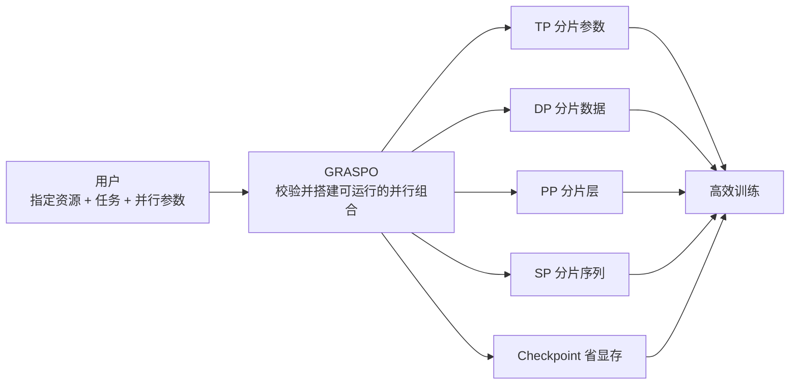
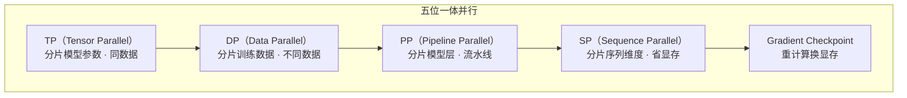
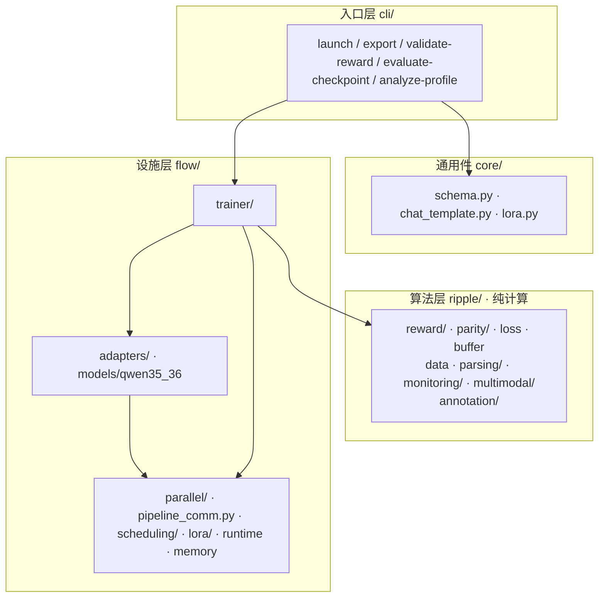
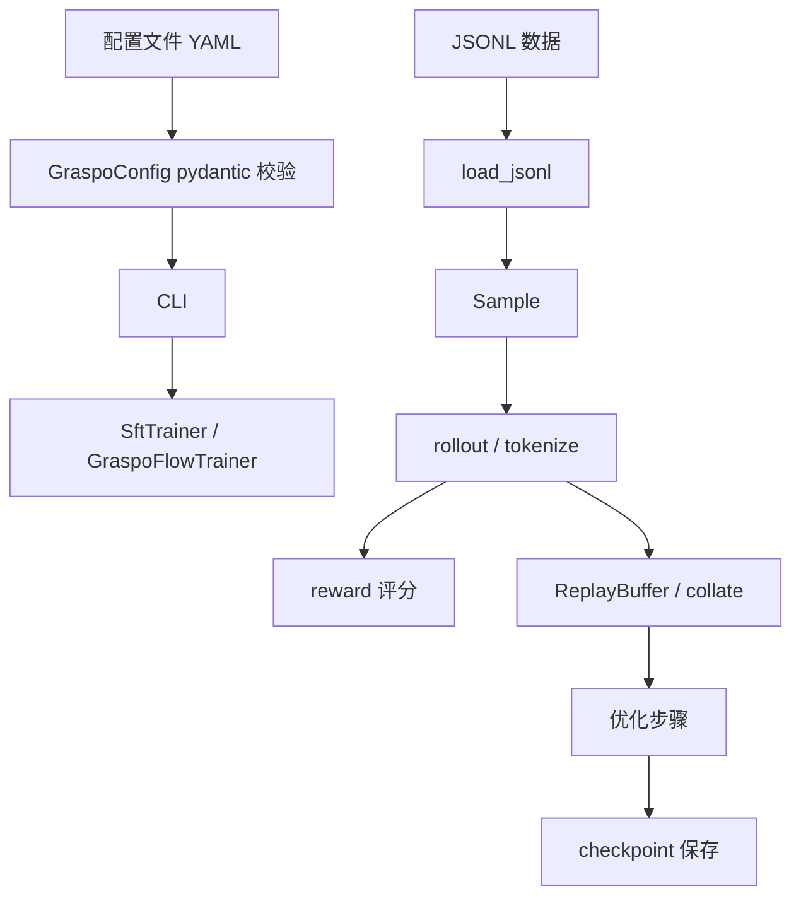
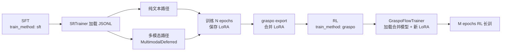

# GRASPO 架构设计

GRASPO 是一个 GRPO 风格的 LoRA 强化学习训练器，面向结构化输出任务（JSON 生成、工具调用、信息抽取等）。设计遵循**边界思维**和**防呆原则**：模块边界清晰、接口稳定、防线前置。

## 核心特性

| 特性 | 说明 |
|------|------|
| **字符级标注驱动 token 级 reward** | 逐字符比对结构模板，通过 offset_mapping 映射到 token——天然 tokenizer 无关。仅首个不匹配字符受罚，其后排除在训练之外 |
| **结构化输出专用 reward + 可扩展** | 递归 dict 比较，双分数（数值精度用于梯度，结构正确用于门控），多目标最优匹配；reward 通过 `GraspoReward` 类按 value 打分 |
| **标注与 reward 分层（核心创新）** | 字符级标注模块对每个字符/每个 token 赋 credit（S/V/T/W/E/D）；reward 只对 value 打分——单个 JSON value / tool-call 参数，或把整段 JSON 序列视作一个 value 赋分。**扩展 reward 无需改标注模块与 token 级梯度训练** |
| **组决策体系与防御纵深** | 六路分类（perfect_skip/trainable/invalid/retry/no_preference_gap）在训练边界拦截噪声，质量加权 advantage 防止收敛到"差组里最好" |
| **RL+SFT 同构** | 同一套 JSONL 数据格式、同一套模型加载、同一套 checkpoint 格式。SFT 教格式，RL 优质量 |
| **ripple/flow 分层** | 算法层（ripple，涟漪）纯计算，命名来自 token 间信用分配的涟漪效应；设施层（flow，水流）负责分布式执行，命名来自数据在流水线中的持续流动 |
| **TP+DP+PP+SP+Checkpoint 五位一体** | 统一 GraspoFlow 后端，五维并行正交：TP 分片参数、DP 分片数据、PP 分片层、SP 分片序列、Checkpoint 节省显存。用户只需配置 `tp_size`、`dp_size`、`pp_size`，框架自动推导 world_size。多投入资源 = 跑更大模型 + 跑更快 |
| **插件化模型适配** | ABC 模板方法 + 注册表，新增模型族只需定义子类并注册，零侵入现有代码 |
| **多模态训练** | 图像+文本联合训练，三层防线防止静默丢图，SFT/RL 双路径编码对齐 |

## 五维并行模型

### 设计哲学：用户指定并行，框架保证可运行

GRASPO 的设计目标是**分布式训练对用户透明且永远有解**。用户显式指定 `tp_size` / `dp_size` / `pp_size`（可选 `sequence_parallel`，TP≥2 时可用）；GRASPO 根据 `world_size = dp_size × tp_size × pp_size` 自动校验并搭建进程组。框架**从不告诉用户"这套设备跑不了这个任务"**——只要基本资源约束满足，就一定存在一组性能最优的 TP+DP+PP+SP+Checkpoint 组合能够运行该任务，用户无需理解 NCCL 拓扑、PCIe vs NVLink 差异，也不必逐卡调试。

**核心价值**：在生产领域模型训练中，调试分布式训练框架通常占据大量开发时间。GRASPO 将这部分工作消除——用户只需要在合理范围内给出并行参数，框架保证该设备上存在一套可运行且负载均衡（每 GPU 一个进程、显存对称）的配置，而不需要处理多卡调试问题。这是 GRASPO 作为开源框架的核心竞争力。

**设计目标**：五位一体（TP+DP+PP+SP+Checkpoint）全组合可用，且**同时在 SFT 与 RL 两种模式下、在 9B 与 27B 上均可用**。这是 GRASPO 的核心能力。**证明该能力的充分必要条件**是跑通 `docs/capability-matrix.md` 中的**全部承诺格**（矩阵逐格列出：卡数 1/2/4 × Qwen3.5-9B / Qwen3.8-27B × 算法 / 模式 / 后端 / 上下文）——只有整张表全部实测通过，才证明五位一体架构成立。**该充要条件当前尚未满足**：矩阵 54 格目前全部未测，故文中既有的架构结论属**设计目标 / 设计依据**，尚不构成已被验证的能力。补齐各项的**实施计划在内部维护**（含内部节点/路径，不入库）。

**实现计划中的补齐项**（当前状态 → 目标）：
- **RL PP>1**：RL 含 PP 的生成路径**已有实现**（提交 `bb41d0f`，2026-08-22，含单测；HEAD 的多模态预检不再拦截 PP>1）。**另有一说**称曾在 Qwen3.6-27B 上以 8 卡 PP + 1F1B 成功训练验证（约 1–2 月前的 git 历史），但**该次运行不在本仓库与当前测试机的可复核范围内**（仓库全历史检索无对应产物/日志，该模型权重不在当前环境，且 1F1B 在该时间窗内亦非默认调度），**故不构成当前能力证据**。此前记录的"模型级 CUDA assert 阻塞"经复核为**误判**——矩阵中 RL 含 PP 各组合应重新实测，而非标为不可用。
- **SP 原生通信**：当前 `reduce_scatter` 因 A800 PCIe 拓扑回退为 `all_reduce+chunk`（`tensor_utils.py` TODO）；按拓扑启用原生 `reduce_scatter`/`all_gather` 是可行的，列入实现计划。
- **全组合实测覆盖**：SFT 9/9 已在 9B/27B 全过；需补齐 RL 全模式、逐卡显存/负载均衡断言、数值等价与单卡基线（即整张矩阵跑通）。

**负载均衡**：每个 GPU 上只运行一个训练进程，且进程组按 `device_id=local_rank` 绑定，避免默认通信组缓冲集中到 cuda:0 造成显存不均；PP 的 layer placement 采用 minimax 使各 stage 计算负载尽量均衡。逐卡显存对称是**设计目标**，实现与验证方式见实现计划与功能矩阵。

| 维度 | 配置 | 默认值 | 作用 | 通信 |
|------|------|:----:|------|------|
| **TP** | `tp_size` | 2 | 分片 attention heads / MLP 维度 | all_reduce(SUM) |
| **DP** | `dp_size` | 1 | 不同数据分片独立训练 | all_reduce(AVG) |
| **PP** | `pp_size` | 1 | 分片模型层到不同 stage | 异步 P2P（isend/irecv）+ 背压 |
| **SP** | `sequence_parallel` | false | TP 组内沿序列维度分片激活值 | reduce_scatter + all_gather |
| **Checkpoint** | `gradient_checkpointing` | true | 前向不存中间激活，反向重计算 | 无 |

**五维正交**：各维度独立配置、独立生效。`world_size = dp_size × tp_size × pp_size`。

**PP 流水线架构**：PP 是 Flow 设施层中最复杂的形态，采用 **Flink 风格"调度与计算分离"**——调度策略（`parallel/scheduling/`，默认 1F1B（唯一调度））决定 forward/backward 时序，异步 P2P 通信层（`parallel/pipeline_comm.py`，双向进程组 + CUDA stream 重叠 + 有界背压）决定数据流动，二者与模型计算层解耦。未来 interleaved / ZeroBubble 作为新调度策略插上即可，无需重写通信或计算层。详见 [Flow 设施层](flow.md)。

## 三层架构

依赖方向：`cli → trainer → adapters → parallel`；`flow → ripple/core` 单向。

### 三层边界

| 层 | 职责 | 单测条件 |
|----|------|---------|
| **ripple/** | 算法逻辑：奖励、advantage、loss、解析、标注、监控 | 纯 CPU，无 GPU/网络/文件 IO |
| **core/** | 跨层契约：配置模型、chat template、LoRA 工具 | 同上 |
| **flow/** | 执行载体：TP/DP/PP/SP 分布式、模型加载、checkpoint、训练循环 | 需 GPU（纯设施逻辑可在单 GPU 上测试） |

**边界判断**：改这个文件会让训练结果变吗？会 → ripple。不会但和配置有关 → core。其余 → flow。

**DP 的边界**：DP 完全在 flow/ 中实现。ripple 永远不知道 `dp_rank`、`dp_size`、`dp_group` 的存在——它只看到"一份数据"，flow 负责把不同数据分片喂给不同的 DP rank。

详细设计见：
- **[Ripple 算法层](ripple.md)** — 奖励、标注、advantage、group 决策、loss
- **[Flow 设施层](flow.md)** — TP+DP+PP+SP 调度、模型适配、训练循环、LoRA 管理

## 数据流

## RL+SFT 同构

GRASPO 的 RL 和 SFT 共享同一套 JSONL 数据格式、同一套模型加载、同一套 checkpoint 格式。用户只需在配置中切换 `train_method`。

### SFT 格式对齐（关键不变式）

SFT 和 RL 共享同一套 JSONL 数据，但 target text 生成方式不同：

- **RL**：模型生成 completion → parser 解析 → 与 target 比较计算 reward
- **SFT**：`build_sft_target_text` 直接生成 XML，**不经过** `tokenizer.apply_chat_template`

**为什么不能走 chat template？** Qwen 的 chat template 在 assistant 消息前插入 `\n response\n` 前缀，但 RL 推理时的 assistant prefix 是 `<|im_start|>assistant\n`。两者不一致会导致格式错位。

**正确做法**：直接生成纯 `<tool_call>...</tool_call>` XML，与模型 RL 推理时的实际输出字符级一致。

### XML 格式对齐：与 Base Model 原生输出一致

Qwen3.5 在预训练中学会的 XML 工具调用格式是参数值位于独立行。如果 SFT 使用内联紧凑格式，LoRA（30M 参数，模型 0.3%）被迫同时改写格式和内容，在 405 条小样本上导致灾难性干扰——模型在新旧格式间摇摆，输出崩溃 XML。

**原则**：SFT 应该只教模型**内容**（what to say），不改变**格式**（how to say）。格式是预训练已经学会的能力，不应该被 LoRA 覆盖。

## 关键设计决策

### ABC 模板方法

运行时和适配器均使用 ABC 定义契约。`GraspoFlowRuntimeBase(ABC)` 定义所有 runtime 必须实现的抽象方法，`TransformerAdapter` 定义模型族适配流程骨架。新增模型只需定义新类并注册，零侵入现有代码。

### 类改目录

`GraspoFlowTrainer` 包含训练循环、rollout、优化、checkpoint 四个关注点，按功能域拆分为多个文件后，每个文件聚焦一个概念。外部通过 `__init__.py` 只 import 类名，完全不感知内部拆分。

### 单后端原则

历史上存在过 `native_tp` 后端。v0.9 完成 GraspoFlow 迁移后立即删除旧代码——不保留"兼容模式"，不保留 `legacy/` 目录。代码库中只存在一套当前架构。

### 五维并行正交

TP、DP、PP、SP、Checkpoint 五个维度彼此独立——用户调整任何一个不影响其他维度的语义。DP 的 `dp_size` 是独立配置项，不自动推导（显式优于隐式，宪法 §2.2）。`world_size = dp_size × tp_size × pp_size` 由框架自动校验。

## 确定性保证

训练可复现性遵循"同一 config + 同一 seed 下，排除不可控随机性后，落盘输出一致"的定义。

- **受控随机性**：`training.seed` 覆盖 random/numpy/torch/cuda RNG；epoch shuffle 用独立 `random.Random(seed + epoch)` 实例
- **不可控随机性**：GPU 内核选择、机器负载导致的耗时差异不在复现保证范围内
- **边界**：跨不同 GPU 型号/驱动版本不承诺比特级一致；需要比特级复现时应在同一台机器同一驱动下运行