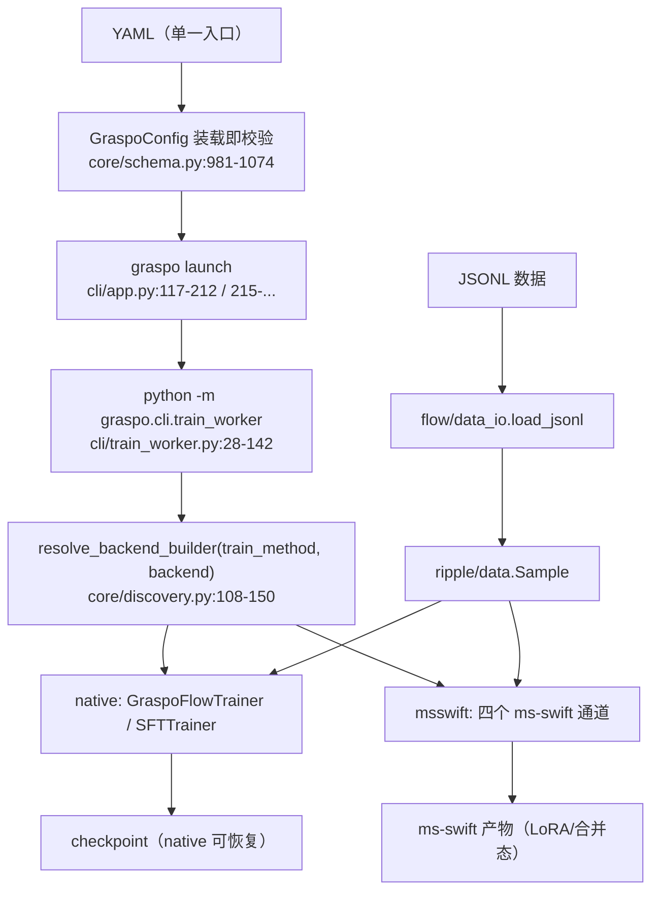

# GRASPO 架构设计

> **文档状态**：2026-09-27 重构式更新。
> 本文是**架构层**文档：只描述"有哪些部件、边界在哪、依赖朝哪走、哪些是硬约束"。
> 算法细节见 [ripple.md](ripple.md)，设施层细节见 [flow.md](flow.md)。
>
> **阅读约定**：每处事实性断言都带 `文件:行号`。**路径基准**：`core/` `ripple/` `flow/` `cli/` `eval/` 开头的相对路径
> 一律相对 `src/graspo/`（如 `core/schema.py:23` = `src/graspo/core/schema.py:23`）；其余路径相对仓库根
>（如 `tests/...`、`docs/...`、`pyproject.toml`）。同一句话/表格行内再次出现的裸 `:行号`
> 沿用该句/该行**最后出现的完整路径**。**没有**行号支撑的段落要么是显式标注的
> **设计目标**，要么是显式标注的 **⚠ 无法核实**——两者都不是已核实的事实。

## 1. 定位

GRASPO（Group Relative Advantage Structured Policy Optimization）是一个**围绕结构化输出
（JSON 生成 / 工具调用 / 信息抽取）的 LLM 训练与评测框架**。它不是一个单一算法训练器，而是
**两个正交维度**的组合：

| 维度 | 取值 | 单一真相源 |
|------|------|-----------|
| **训练方法** | `graspo`（GRPO 风格 RL）/ `sft` / `cpt`（继续预训练）/ `opd`（on-policy 蒸馏） | `TrainMethod`，`core/schema.py:23` |
| **训练模式** | `lora`（只训适配器）/ `full`（全参） | `TunerType`，`core/schema.py:16`；归一化 `resolve_tuner_type`，`:118-127` |
| **后端** | `native`（自研 GraspoFlow）/ `msswift`（委托 ms-swift） | entry points，`pyproject.toml:70-72` |

**与旧版文档的关键差异（结构性）**：旧版把 GRASPO 定义为"一个 GRPO 风格的 LoRA 强化学习
训练器"，并把"单后端原则"列为设计决策。两处都与现状不符——现在有 **4 种训练方法 × 2 种模式
× 2 个后端**，且 `backend` 是配置里的显式字段（`core/schema.py:987`）。本次重构把"方法 ×
后端"提到文档最前面（§2）、把旧"单后端原则"替换为双后端注册表（§2.2），并新增一条**架构层
硬约束：禁用 DeepSpeed**（§3）。

### 1.1 能力一览（与代码对应）

| 能力 | 载体 | 证据 |
|------|------|------|
| 字符级标注驱动 token 级 reward | `ripple/annotation/`、`ripple/reward/` | `ripple/algorithm_core.py:1-31` |
| 组决策（六态：`perfect_skip` / `retry` / `invalid` / `invalid_no_preference_gap` / `trainable_max_correct` / `trainable_not_correct`） | `ripple/group_decision.py` | `:16-22`、`classify_group` `:80-150` |
| PPO-clip loss / 后端无关算法核 | `ripple/loss.py`、`ripple/algorithm_core.py` | `ripple/algorithm_core.py:32-49` |
| native 五维并行（TP/DP/PP/SP+GC） | `flow/parallel/`、`flow/adapters/` | `flow/__init__.py`、`flow/runtime.py:208-212` |
| ms-swift 四通道（SFT/GRPO/CPT/GKD） | `flow/msswift/` | `flow/msswift/_config_mapping.py:64` |
| 模型族插件（entry points） | `flow/adapters/models/{qwen3,qwen35_36,common}/` | `pyproject.toml:66-68` |
| 多模态（三层防线） | `flow/trainer/preflight.py` + `ripple/multimodal/contract.py` | 见 §10 |
| 效果评测链路（ELAM V5 + vLLM） | `eval/`、`cli/eval_commands.py` | `eval/__init__.py:1-6` |
| 验收判据 A1–A6 | `core/result_judge.py` | `:10-20` |

**两条必须保留的边界主张**（旧文档即有，且与代码一致）：

- **标注与 reward 分层**：标注模块对每个字符/token 赋 credit（S/V/T/W/E/D），reward 只对
  value 打分；扩展 reward 不需要改标注模块与 token 级梯度训练
  （标注契约 `ripple/annotation/char_tag.py:13-42`，reward 入口 `ripple/reward/reward.py:342`
  的 `REWARD_REGISTRY = _discover("graspo.rewards")` 注册表）。
- **ripple / flow 命名与分层**：ripple（涟漪）= 算法层，命名来自 token 间信用分配的涟漪
  效应；flow（水流）= 设施层，命名来自数据在流水线中的持续流动
  （`ripple/__init__.py:1-4`、`flow/__init__.py:1-11`）。**术语一律用这两个名字**，
  不使用历史别名。

## 2. 两个正交维度：训练方法 × 后端

### 2.1 训练方法（4 种）

`TrainMethod = Literal["graspo", "sft", "cpt", "opd"]`（`core/schema.py:23`）。
方法名是**唯一真相源**，能力矩阵的「算法」行与它一一对应（`core/schema.py:18-22`）。

### 2.2 后端（2 个）与注册路由

后端**不**用 `if/elif` 硬编码，而是走 entry points 注册表（`core/discovery.py:21-53`）：

| 注册表组 | native | msswift |
|---------|--------|---------|
| `graspo.backends`（RL） | `create_native_trainer` | `create_msswift_trainer` |
| `graspo.sft_backends` | `create_native_sft_trainer` | `create_msswift_sft_trainer` |
| `graspo.cpt_backends` | —（无实现） | `create_msswift_cpt_trainer` |
| `graspo.opd_backends` | —（无实现） | `create_msswift_opd_trainer` |

`(train_method, backend) → 注册表` 的映射表是 `_REGISTRY_BY_TRAIN_METHOD`
（`core/discovery.py:58-63`），解析入口是 `resolve_backend_builder`
（`core/discovery.py:108-150`）。未知 `train_method` **直接拒绝**，不退化成默认算法
（`core/discovery.py:137-143`）。

后端名本身的合法性由 `select_backend` 判（`flow/backend_selection.py:13,26-42`），
配置装载期**不重复判**"后端名是否存在"——避免两处各判一次（`core/schema.py:36-40`、
`:101-108` 的注释即此约定）。

**待收口（事实）**：`pyproject.toml:63-72` 只声明了 `graspo.rewards` /
`graspo.adapters` / `graspo.backends` 三组；`sft_backends` / `cpt_backends` /
`opd_backends` 三组目前只在 `core/discovery.py:37-52` 的开发回退表里登记。安装态下
`entry_points` 查不到这三组会**回退**到该表（`core/discovery.py:97-102`），功能因此可用；
但"entry_points 是生产真相源"（`core/discovery.py:19`）对这三组尚未成立。

**启动链**：`graspo launch`（`cli/app.py:469-613` 注册子命令）→ `build_launch_plan`
（`cli/app.py:146-212` native / `:215-...` msswift，都是**同一个 worker 入口**）→
`python -m graspo.cli.train_worker`（`cli/train_worker.py:28-142`）→
`select_backend` + `resolve_backend_builder` → `builder(config, selection).train(smoke=...)`
（`cli/train_worker.py:141-142`）。CLI 命令集现为：`launch` / `export` /
`validate-reward` / `evaluate-checkpoint` / `analyze-profile`（`cli/app.py:473-604`）+
`record-gpu-memory`（`cli/gpu_monitor.py:664-666`）+ `eval {prepare,export,run,delta}`
（`cli/eval_commands.py:338-390`）。旧版文档只列了前五个，且没有 `eval` 域。

### 2.3 合法组合矩阵（配置装载期 fail-closed）

`TRAIN_METHOD_BACKENDS`（`core/schema.py:29-34`）：

| `train_method` | native | msswift |
|----------------|:------:|:-------:|
| `graspo` | ✅ | ✅ |
| `sft` | ✅ | ✅ |
| `cpt` | ⛔ 拒绝 | ✅ |
| `opd` | ⛔ 拒绝 | ✅ |

拒绝动作发生在**配置加载**（`validate_train_method_combination`，
`core/schema.py:70-133`；由 `GraspoConfig` 的 model_validator 调用，`:1146-1159`），
而不是静默路由到别的训练器。`opd` 还强制要求**具体教师来源**（`:120-133`），
来源**二选一**：

- `distill.teacher_model_path` —— 训练进程内的本地冻结教师（`--teacher_model`）；
- `distill.teacher_model_server` —— 外部教师服务地址（`--teacher_model_server`）。

两者**至少给一个**（都不给即拒绝），且**互斥**（同时给即拒绝——`DistillConfig`
的 model validator，`core/schema.py:585-605`；ms-swift 侧对同设亦显式 raise）。
走 `teacher_model_server` 时还**必须**配 `distill.gkd_logits_topk`（外部教师 API 只回
top-k logprobs；缺失亦由 `DistillConfig` 在配置加载期拒绝——`core/schema.py:608-627`，
上游 `rlhf_args.py:762-765` 同样无条件 raise）。
**约束语义未放宽**：用户 2026-09-18 拍板"不留教师待定"（教师 = Qwen3.8-27B、
学生 = Qwen3.5-9B）；**变更依据：2026-09-30 主席裁定走路线 B（教师外挂
`swift deploy` 服务）⇒ 来源形态由"仅路径"扩展为"路径**或**服务 URL"，
"必须有具体来源"的约束本身不变**。

`ROLLOUT_TRAIN_METHODS = {"graspo"}`（`core/schema.py:42-48`）：只有 RL 走自回归生成，
SFT 不采样，CPT/OPD 在 native 侧本就被拒。该常量被 native 的 PP rollout 闸门消费
（`flow/runtime.py:446,578`）。

## 3. ★ 架构层硬约束：禁用 DeepSpeed

> **条款（用户 2026-09-27 指令，强制）**：GRASPO **不得再使用 DeepSpeed 作为训练后端**。
> 梯度裁剪/范数守卫与梯度计数所需的 `grad_norm` 读数在 DeepSpeed 路径下**不可信**，
> 而"不可信的读数"会让验收判据（A6 等）与能力矩阵判据③失去鉴别力——这属于**防线失效**，
> 不是"性能取舍"。今后新配置、新矩阵档位、新示例与新文档一律不得选 DeepSpeed；
> 并行需求的替代路径为 **ms-swift 的 Megatron / FSDP 模块**，或 **native 后端**（优先级见 §3.3）。

### 3.1 理由：grad_norm 守卫/计数不可信（证据链）

1. **加速层直接转发引擎读数**：`accelerate` 的 `clip_grad_norm_`（def `:2946`）在
   **DeepSpeed 分支**（`accelerate/accelerator.py:2982-2986`）直接
   `return self.deepspeed_engine_wrapped.get_global_grad_norm()`（`:2985`）——**不是**自己
   计算范数。作为对照，同函数的 FSDP 分支走 `model.clip_grad_norm_` / torch 原生
   （`:2971-2981`），默认路径走 `torch.nn.utils.clip_grad_norm_`（`:3006-3007`）。
   同文件 `clip_grad_value_`（def `:3009`）对 DS/FSDP 直接抛异常
   （`accelerate/accelerator.py:3031-3032`：`"DeepSpeed and FSDP do not support
   clip_grad_value_"`）——即 DS 路径下**值裁剪**根本没有实现，只能靠上述转发来的范数。
   **可核性**：`accelerate` 不在本仓依赖（`pyproject.toml:13-40`），本机 `.venv` 未安装；
   上述行号已用**与 228 镜像逐字节一致的副本**（accelerate 1.14.0，sha256 与副本路径见
   工位报告）复核，**不是**本仓 `文件:行号` 意义上的引用。
2. **DeepSpeed 的写入时机与提前返回**：DS 在 `optimizer.step()`**之后**才给
   `_global_grad_norm` 赋值；ZeRO 溢出分支提前 `return`、不计算范数。⇒ 在 `step()` 前取
   读数的调用方可能拿到**上一步的陈旧值**。上游 ms-swift issue #3930 有同类反馈
   （同上，属上游引用）。
3. **本仓侧同类事实（可核）**：能力矩阵台账记录了 ms-swift 后端**不上报**"跨全部 rank
   非有限跳过数"——**上游包路径** `swift/trainers/mixin.py:744-779` 在梯度 NaN 时置 `grad=None` 仍照常
   `step`、只判 `isnan` 不判 `isinf`、且无计数；`:1078-1081` 在 `grad_norm` 为 None 时
   `根本不写该键`。⇒ **该键在 ms-swift 后端不可用作验收证据**（判据③读数缺失）。该口径已于
   **2026-09-28 收口**（以逐步 instrumentation 补齐）。
4. **本仓把 `grad_norm` 当验收证据**：A6 的判据是"loss 与 grad_norm 全程 finite，
   NaN/Inf 即不通过"（`core/result_judge.py:17-18`）；native 侧还为 `grad_norm` 定义了
   **口径标签**并把标签随值落盘，专门防止误读（`flow/adapters/transformer_adapter.py:118-157`）。
   ⇒ 后端若给出陈旧/缺失的范数，A6 与矩阵判据③就**双双失真**。

### 3.2 现状（代码里仍在的 DeepSpeed 接线——迁移遗留，非"推荐用法"）

| 位置 | 字段/常量 | 消费点 |
|------|-----------|--------|
| msswift 标准通道 | `msswift.deepspeed`（S3 ZeRO） | `core/schema.py:757` → `--deepspeed`，`flow/msswift/_config_mapping.py:168` |
| msswift | `msswift.zero_hpz_partition_size`（S4 ZeRO++） | `core/schema.py:759` → `flow/msswift/_config_mapping.py:169` |
| msswift | `msswift.deepspeed_autotp_size`（S5 AutoTP） | `core/schema.py:761` → `flow/msswift/_config_mapping.py:170`；仅全参，`flow/msswift/_config_mapping.py:749-760` |
| msswift 蒸馏 | `distill.teacher_deepspeed` | `core/schema.py:531` → `--teacher_deepspeed`，`flow/msswift/_config_mapping.py:567` |
| native | **显式禁止导入 DS/FSDP/Megatron/vLLM/Ray 等** | `flow/runtime.py:69-78`（`FORBIDDEN_RUNTIME_MODULES`），运行时断言 `:613-618`，声明见 `:208-212` |

> **迁移边界（如实声明）**：本条款是**架构约束**，本文档**不**声称上述代码已被改造。
> 遗留字段与矩阵配方属"待迁移项"；`msswift.deepspeed*` 字段目前仍是合法配置项
> （无 validator 拒绝），迁移未完成前不得据此认为"仍推荐 DS"。

### 3.3 替代路径优先级（按代码中的实际证据，不编造）

| 优先级 | 路径 | 代码现状 | 证据 |
|:---:|------|---------|------|
| **1** | **native 后端** | **已实现**：LoRA 支持 TP/DP/PP/SP（`core/schema.py:555-566`）；全参**仅 PP** | 五维配置 `core/schema.py:546-668`；全参限制 `:148-173`（`tp_size>1` 或 `dp_size>1` 被拒）；native 无 DS 依赖 `flow/runtime.py:69-78` |
| **2** | **ms-swift FSDP / FSDP2** | **已接线**（端到端实测证据留存于 `.local/`，不随仓库发布） | 字段 `core/schema.py:763`（注释：与 DeepSpeed 互斥）→ `--fsdp` 透传 `flow/msswift/_config_mapping.py:171`；契约测试锁名 `tests/flow/msswift/test_config_mapping.py:121,183` |
| **3** | **ms-swift Megatron / Megatron-FSDP** | **半成品（更靠前一步）**：MG1–MG11 配置透传函数已就绪，**启动通道未接线、超参映射表未完成** | 字段 `core/schema.py:671-723`（含 `use_megatron_fsdp` `:692`）；透传 `flow/msswift/_config_mapping.py:196-345`；主映射显式 `include_megatron=False`（`:587`）；仓库内**无** `graspo_to_ms_swift_megatron_argv` 定义、**无** `swift.megatron.*_main` 调用（仅注释提及，`:326-327`）；超参词汇差异与"待后续实现"见 `:333-340` |
| **4** | **native 扩展**（全参 TP/DP 梯度同步） | **待实现**：当前 fail-closed 拒绝 | `core/schema.py:165-173`（原因：native 梯度同步实现只覆盖 LoRA 参数，`flow/lora/lora_linear.py` 的 `_sync_dp_lora_grads` / `_sync_nonsharded_lora_grads`，见 `core/schema.py:148-154`） |
| 附 | native 优化器态 CPU offload（部分替代 ZeRO-2/3 offload 的省显存作用） | **已实现但默认关闭**，且只接线 qwen35_36 | 字段 `core/schema.py:575-592`；非法组合校验 `:183-225`；消费点 `flow/adapters/models/qwen35_36/training_sft.py` 的 `_build_optimizer`（接线事实见 `core/schema.py:589-591`） |

⚠ **无法核实（仅限 Megatron 通道）**：Megatron / Megatron-FSDP 的**端到端可用性**（能否在
Qwen3.5-9B/27B 上真实训完、显存与数值是否达标）。本仓只有配置映射与契约测试，
**没有该通道的实跑产物**，第 3 项因此只能标"半成品"。
**FSDP2 通道已于 2026-09-28 取得端到端证据**（跑次台账已按宪法 §16.1 移出仓库，见 `.local/repo-moved-out/`）。
**逐档实测读数不在本文档复述。**

## 4. native 后端：GraspoFlow 五位一体

> 旧版文档把"五维并行"当成**整个框架**的模型。实际上它只描述 **native 后端**（`backend: native`，
> 默认值见 `core/schema.py:987`）——msswift 后端的并行度由 ms-swift 决定（§5）。
> 这是本次重构把"五维并行"从顶层降为 §4 的原因。

**设计哲学（⚠ 设计目标，非本文件核实）**：用户显式指定 `tp_size` / `dp_size` / `pp_size`
（可选 `sequence_parallel`），框架据此校验并搭建进程组，**不告诉用户"这套设备跑不了"**——
只要基本资源约束满足，就存在一套可运行且负载均衡的组合。该主张的核心是"分布式对用户透明"，
其**证据是能力矩阵逐档实测**（§12），不是本文件的代码引用。代码侧的**事实**部分只有：
配置项存在且显式（`core/schema.py:555-566`）、`world_size` 自动校验
（`flow/runtime.py:394-426`）、全参组合被 fail-closed 拒绝（`core/schema.py:165-173`）。

### 4.1 五个维度

`world_size = dp_size × tp_size × pp_size`（`core/schema.py:549`；校验见
`flow/runtime.py:394-426`）。

| 维度 | 配置 | 默认值 | 作用 | 通信 |
|------|------|:----:|------|------|
| **TP** | `native.tp_size` | **1** | 分片 attention heads / MLP 维度 | all_reduce(SUM) |
| **DP** | `native.dp_size` | 1 | 不同数据分片独立训练 | all_reduce(AVG) |
| **PP** | `native.pp_size` | 1 | 分片模型层到不同 stage | 异步 P2P（isend/irecv）+ 背压 |
| **SP** | `native.sequence_parallel` | false | TP 组内沿序列维度分片激活值 | reduce_scatter + all_gather |
| **Checkpoint** | `model.gradient_checkpointing` | true | 前向不存中间激活，反向重计算 | 无 |

默认值来源：`core/schema.py:555-557`（tp/dp/pp）、`:566`（sequence_parallel）、
`:279`（gradient_checkpointing）。**旧文档写"TP 默认 2"**，与 `:555` 的 `tp_size: int = 1`
不符——已更正。
"通信"列的代码来源：TP `all_reduce(SUM)`（`flow/parallel/tensor_utils.py:152`）；
DP `all_reduce(AVG)`（`flow/lora/lora_linear.py:282`）；PP 异步 P2P
（`flow/parallel/pipeline_comm.py:1-6`）；SP `reduce_scatter + all_gather`
（`flow/parallel/tensor_utils.py:190-192`、`:201,223`；当前 reduce_scatter 为回退实现，
见 §4.4）；Checkpoint 是重计算、无集合通信（`core/schema.py:279` 的字段语义）。

约束：`sequence_parallel` 要求 `tp_size >= 2`（`flow/runtime.py:404-405`）；
`dp_size >= 1`（`core/schema.py:664-668`）；`pp_micro_batch_size` / `micro_batch_size` ≥ 1
（`flow/runtime.py:406-409`）。

**边界（事实）**：**全参模式下 native 只支持 PP 分片**——`tp_size>1` 或 `dp_size>1` 一律
拒绝（`core/schema.py:165-173`）。因为 native 的梯度同步实现只覆盖 LoRA 参数
（`core/schema.py:148-154`）。⇒ "五维正交"在 native + 全参组合下**不成立**，旧文档未声明该边界。

**DP 的边界**：DP 完全在 `flow/` 内实现；`ripple/` 不出现 `dp_rank` / `dp_size` / `dp_group`
（`flow/parallel/state.py:1-8` 的 `GraspoFlowState` 持有这些；`ripple/` 导入清单里无
`flow.*`，见 `tests/test_ast_boundary.py:135-150` 的强制规则）。
**ripple 是"单份数据"视角**——flow 负责把不同分片喂给不同 DP rank（`core/schema.py:558-560`）。

### 4.2 依赖红线：native 不引入外部并行框架

`FORBIDDEN_RUNTIME_MODULES = ("megatron", "nemo_rl", "vllm", "ray", "deepspeed",
"accelerate", "transformer_engine", "apex")`（`flow/runtime.py:69-78`）。
native 运行期对这些模块的导入断言在 `validate()` 里执行（`flow/runtime.py:237-239`，由 `setup()` 调用 `:241-243`），
实现为 `assert_forbidden_runtime_modules_not_imported`（`:613-618`）。
类文档亦声明同一边界（`flow/runtime.py:208-212`）。启动日志里落 `dependency_boundary`
（`flow/trainer/trainer.py:170-176`）。

### 4.3 PP：调度与计算分离

- 调度层 = `flow/parallel/scheduling/`，策略接口 `PipelineScheduler`
  （`flow/parallel/scheduling/pipeline_scheduler.py:1-5`），注册表只登记 `one_f_one_b` / `1f1b`
  （`flow/parallel/scheduling/factory.py:15-19`）；默认 `one_f_one_b`（`core/schema.py:662`）。
- 通信层 = `flow/parallel/pipeline_comm.py`（双向进程组 + 显式 tag + CUDA stream 重叠 +
  有界背压，`flow/parallel/pipeline_comm.py:1-6`）。
- 旧 GPipe 调度已删除（`flow/parallel/scheduling/factory.py:34-35`；`core/schema.py:658-661`）。
- **PP rollout 闸门（缺陷 P6，2026-09-22）**：`native + pp_size>1 + rollout` 默认
  **启动期拒绝**，需 `native.allow_unverified_pp_rollout=true` 显式预授权
  （`flow/runtime.py:430-462`；字段 `core/schema.py:646-657`）。原因：该组合从未有一档
  端到端通过，实测形态是首个 prefill 后无界挂死（NCCL 看不见）。**旧文档曾称"RL 含 PP 的
  生成路径已有实现"，未提"默认被闸门拒绝"**——两件事都真：生成实现在
  `flow/adapters/models/qwen35_36/generation.py`（`_pipeline_generate_groups` 等，
  `:62-63,228-229,696-870`），但启动闸门默认关。另有
  `flow/adapters/models/qwen35_36/generation_pp.py` 定义了
  `_Qwen35GenerationPPMethods`（`:26`）却**未被 `Qwen35Adapter` 继承**
  （`flow/adapters/models/qwen35_36/adapter.py:34-46` 只继承 generation / training / training_sft / logprobs /
  pipeline_forward）⇒ 该文件是未接线代码（与 `core/schema.py:648` 的注释一致）。
- 会合点有界性：`native.pp_rollout_p2p_timeout_sec`（默认 600，`core/schema.py:625`）+
  `native.pp_rollout_no_progress_sec`（默认 300，`:634`）+ 看门狗
  （`flow/parallel/rendezvous_watchdog.py:1-8`）。
- 末 stage logits 显存预算闸门：`native.pp_rollout_logits_budget_gib`（默认 0=auto，
  `core/schema.py:645`；估算 `flow/runtime.py:561-...`）。单一真相源常量
  `PP_ROLLOUT_PREFILL_LAST_ONLY = True`（`core/schema.py:50-64`）。

### 4.4 SP：原生 reduce_scatter 目前是回退态

`_reduce_scatter_sp` 当前回退为 `all_reduce + chunk`，注释写明原因是 native
`dist.reduce_scatter` 在 PCIe-only A800 拓扑上挂死（`flow/parallel/tensor_utils.py:237-259`，
`TODO: re-enable native reduce_scatter` 见 `:254`）。
⚠ **无法核实**：注释所称"NVLink 连卡上原生 reduce_scatter 可用"（`:243-246`）在本仓无实测
产物支撑——本仓只有 CPU/单卡单测与本机环境，不构成该断言的能力证据。

### 4.5 负载均衡（设计目标，标注）

- **事实**：每个 GPU 一个训练进程、进程组按 `device_id=local_rank` 绑定
  （`flow/parallel/state.py:1-8` 的 rank 拓扑 `rank = dp_rank × (tp×pp) + pp_rank × tp + tp_rank`）；
  PP layer placement 采用 minimax / 手动区间（`flow/parallel/placement_plan.py:1-3`）。
- **⚠ 设计目标（未在本文件核实）**：逐卡显存对称、负载均衡的**实测结论**不在架构文档。

## 5. msswift 后端：委托 ms-swift

### 5.1 接入方式：进程内 Python API（决策 D6），不是 CLI 透传

`import swift` 作库，把 graspo 的 GRPO 训练器挂到 `swift.trainers.TrainerFactory.TRAINER_MAPPING`
的 `'grpo'` 键上，经 `swift.pipelines.rlhf_main` 内跑（`flow/msswift/trainer.py:1-16,595-643`；
注册入口 `flow/msswift/plugin.py:1-14`）。**无子进程、无 shell、不把 graspo YAML 喂给
ms-swift CLI**（`flow/msswift/trainer.py:10-14`）。launch 侧产出的命令与 native **同形**
（同一 worker 入口，差别只在进程数来源：`msswift.nproc_per_node` vs
`dp×tp×pp`，`cli/app.py:222-254`）。

**实测 API 事实（ms-swift 4.5.3）**：`swift.llm` 子模块不存在，入口是 `swift.pipelines`。
`RLHFArguments.rlhf_type` 是 `Literal[...]`，不接受 `graspo_grpo` 这类自定义名
（`flow/msswift/trainer.py:18-27`）。

### 5.2 四种训练方法各自的 ms-swift 通道

| `train_method` | ms-swift 通道 | 实现文件 |
|----------------|---------------|---------|
| `sft` | `SftArguments` / `swift.pipelines.sft_main` | `flow/msswift/sft_trainer.py`（工厂 `:188-201`） |
| `graspo` | `RLHFArguments` + `--rlhf_type grpo` / `rlhf_main` | `flow/msswift/trainer.py`（`GraspoMsSwiftGRPOTrainer` `:90`；工厂 `:768-776`） |
| `cpt` | `PretrainArguments` / `swift.pipelines.pretrain_main`（≡ `swift pt`） | `flow/msswift/cpt_trainer.py:1-46` |
| `opd` | `RLHFArguments` + `--rlhf_type gkd`（教师 = 独立冻结模型） | `flow/msswift/opd_trainer.py:1-50` |

`Stage = Literal["sft", "rlhf", "cpt", "opd"]`（`flow/msswift/_config_mapping.py:64`）。

**opd 为何走 GKD Path A 而非 GRPO+teacher**：教师散度直接作 loss、教师 logits 进程内前向，
是 on-policy 蒸馏的最短通路，且不需要教师 logprob 数据契约（`flow/msswift/opd_trainer.py:22-38`）。

**算法核同源**：msswift 的 RL 不重新实现算法，直接装配 native 同款的
`ripple.algorithm_core.GraspoAlgorithmCore`（`flow/msswift/trainer.py:108-120`；
`ripple/algorithm_core.py:1-8` 明确"不依赖 graspo.flow 的任何模块"）。msswift 侧的 RL 修复了
"ratio 恒 1"缺陷（当前策略前向 vs 基线，`flow/msswift/trainer.py:44-57`）。

### 5.3 配置映射：唯一映射点，纯计算

`flow/msswift/_config_mapping.py` 是"graspo 配置 ↔ ms-swift 参数"的**唯一映射点**，
纯映射、零 IO、零 ms-swift 导入（`:1-20`）。字段名与 ms-swift 官方参数名逐字对应
（`core/schema.py:671-679,737-743`）。不可映射项（`trust_remote_code`、
`chat_template_kwargs`、`lora.target_preset`）显式声明、不假装支持（`flow/msswift/_config_mapping.py:22-35`）。
msswift 段字段清单见 `core/schema.py:745-814`。

**两处显式优先级**：`--attn_impl`（`msswift.attn_impl` 优先，否则 `model.attn_implementation`，
`flow/msswift/_config_mapping.py:233-239`）；RoPE 键名在映射层就换成 transformers 5.x 的 `rope_type`
（`flow/msswift/_config_mapping.py:242-272`）。

### 5.4 已知缺口（如实声明）

- ms-swift 未安装时不静默降级，抛精确 `RuntimeError`（`flow/msswift/trainer.py:69-86`、
  `flow/msswift/cpt_trainer.py:52-70`）。
- **Megatron 启动通道未接线**（§3.3 第 3 项）——`megatron` 段只在显式调用透传函数时产出
  参数向量，且**不属于**标准通道 argv（`flow/msswift/_config_mapping.py:585-587`）。
- ms-swift 后端**不上报**跨 rank 非有限跳过计数 ⇒ 原取数通道下判据③不可测。
  这是 §3 硬约束的直接动因之一；**该缺口已于 2026-09-28 以逐步 instrumentation 收口**。

## 6. 分层与依赖边界

> 旧版文档写的是"三层架构"（cli / ripple / core / flow）且把 `core/` 列为 L2 通用件。
> 现状有两处不符：①`eval/` 是**独立的评测域**，旧图完全没有它；②`core/` 已从 3 个文件
> 扩到 7 个（新增 `determinism` / `discovery` / `gpu_guard` / `result_judge`）。
> 本次改为"包结构 + 依赖铁律"两节。

### 6.1 包结构

```
src/graspo/
├── cli/       # 用户接口：launch/export/validate-reward/evaluate-checkpoint/
│              # analyze-profile/record-gpu-memory/eval；worker 入口        pyproject.toml:61
├── core/      # 跨层契约（纯计算，零设施）：schema / chat_template / lora /
│              # discovery / determinism / gpu_guard / result_judge          core/__init__.py:1-3
├── ripple/    # 算法层（纯计算，后端无关）：reward / annotation / parsing /
│              # monitoring / multimodal / group_decision / loss / buffer / data / algorithm
├── flow/      # 设施层：runtime / trainer / adapters / parallel / lora /
│              # logger / checkpoint / data_io / memory / logging / progress_metrics /
│              # backend_selection / msswift                                        flow/__init__.py:1-11
└── eval/      # 评测域：criteria / dataset / evaluate / guard / merged_export /
               # orchestrator / schema / vllm_client                          eval/__init__.py:1-6
```

### 6.2 依赖铁律（由 AST 测试强制）

`tests/test_ast_boundary.py` 是这些边界的**执行器**（不是文档）：

| 规则 | 断言位置 |
|------|---------|
| `ripple/` **不得** import `flow/`（算法层零设施依赖） | `tests/test_ast_boundary.py:135-150` |
| `core/` **不得** import `flow/` 或 `ripple/`（通用契约不依赖上层） | `:173-192` |
| `flow/parallel/scheduling/` **不得** import `adapters/models/` 或 `trainer/`（调度与计算解耦） | `:152-171` |
| 跨层**不得**双向导入（无环） | `:194-230` |
| `flow → ripple` 是**合法方向**，基线 ~41 条导入（防静默增长） | `:110-133` |

补充（导入清单核实，非 AST 测试）：`ripple/` 的实际外部导入只有 `graspo.core.*`
（`ripple/algorithm_core.py:15`、`ripple/data.py:17`、`ripple/reward/reward.py:9`、`ripple/monitoring/stats.py:6`）；
`eval/` 只依赖 `graspo.core.gpu_guard`（`eval/guard.py:43`）与本包内模块，不依赖 `flow/`。

### 6.3 各层职责与判据

| 层 | 职责 | 边界判据 |
|----|------|---------|
| **ripple/** | 算法逻辑：奖励、标注、组决策、advantage、loss、解析、监控 | "改这个文件会让训练结果变吗？会 → ripple"（`ripple/__init__.py:1-4`） |
| **core/** | 跨层契约：配置模型与不依赖训练方法论的通用件 | 不依赖训练方法论、零设施（`core/__init__.py:1-3`） |
| **flow/** | 执行载体：分布式、模型加载、checkpoint、训练循环、LoRA、日志、后端选择 | 需要 GPU / 分布式 / 文件 IO（`flow/__init__.py:1-11`） |
| **eval/** | 评测链路（数据集、口径、聚合、vLLM 客户端、产物契约） | 纯计算部分零设施，设施部分只走 vLLM HTTP（`eval/__init__.py:1-6`） |

**边界判断**（保留旧文档的三段判据并补 eval）：改文件会变训练结果 → ripple；不会但属跨层
契约 → core；需要真实世界资源 → flow；只服务评测结论 → eval。

## 7. 数据流与启动链



要点：
- **配置是唯一入口**：训练配置只走 `--config` 指向的 YAML（`cli/train_worker.py:29-31`），
  环境变量只承载标准基础设施量（`AGENTS.md:51-58` 硬约束 3）。
- **锁卡守卫先于一切**：`require_gpu_lock_or_exit()`（`cli/train_worker.py:74-82`、
  `cli/app.py:118-121`；实现 `core/gpu_guard.py:1-4`）。
- **确定性开关早于 torch/NCCL 初始化**（`cli/train_worker.py:54-73`，见 §9）。
- **日志目录身份来自 config**：`training.run_name`（`cli/train_worker.py:86-95`），
  不再用 `GRASPO_RUN_ID` 环境变量。

## 8. 四种训练方法的同构与差异

### 8.1 共享的部分（同构）

四种方法共享：同一份 JSONL 数据契约（`ripple/data.py`）、同一套配置入口
（`core/schema.py:981-1012`）、同一套模型适配器注册表（`pyproject.toml:66-68`）、
同一套 CLI 启动链（`cli/train_worker.py:130-141`）。native 与 msswift 两个后端在算法侧
**共用同一个算法核**（`ripple/algorithm_core.py`；msswift 侧装配见 `flow/msswift/trainer.py:108-120`）。

差异：SFT 消费已 tokenize 的样本、RL 消费 rollout group，因此 SFT 有**独立注册表**
（`core/discovery.py:33-36` 的注释）；CPT 走**纯文本续训**数据集形态
（`flow/msswift/dataset.py::build_cpt_rows`，`flow/msswift/cpt_trainer.py:16-27`）；OPD 走**纯提示词**
+ 教师（`flow/msswift/opd_trainer.py:1-50`）。

### 8.2 SFT 格式不变式（保留：仍然正确）

- **RL**：模型生成 completion → parser 解析 → 与 target 比较算 reward。
- **SFT**：`build_sft_target_text` 直接生成 XML，**不经过** `tokenizer.apply_chat_template`
  （`ripple/parsing/xml.py` 提供，消费点 `flow/msswift/dataset.py:391-400,506-512`）。
  理由：Qwen chat template 在 assistant 前插 `\n</think>\n`，与 RL 推理的
  `<|im_start|>assistant\n` 前缀不一致。两个后端共用同一个 `build_sft_target_text`
  （`flow/msswift/dataset.py:12-15`）——这是"RL+SFT 同构"在**格式**上的落点。
- **原则**：SFT 只教内容、不改格式；格式是预训练已学会的能力，不应被 LoRA 覆盖。

### 8.3 算法细节的归属

奖励 / 标注 / advantage / 组决策 / loss 已迁入 `ripple/`（`flow/trainer/helpers.py:1-6`
说明"算法层函数已迁入 ripple/ 对应模块"）。详细设计**不在本文档**，见
[ripple.md](ripple.md) 与 [flow.md](flow.md)。

## 9. 确定性保证

**定义**：同一 config + 同一 seed 下，排除不可控随机性后，落盘输出一致。
⚠ 该定义是**规范**；它的可执行判据是 A4（"同 config 同 seed 双跑一致"，
`core/result_judge.py:15`），其容差按实测标定（`core/result_judge.py:303-373`）。

**受控随机性**：
- `training.seed` 覆盖 random/numpy/torch/cuda RNG（`flow/trainer/helpers.py::_set_random_seed`，
  调用点 `flow/trainer/trainer.py:161`、`flow/trainer/sft_trainer.py:148`）；
- epoch shuffle 用独立 `random.Random(seed + epoch)` 实例（`core/schema.py:311`）；
- **新增（旧文档未写）**：确定性钉定开关集中在 `core/determinism.py`（**全仓唯一真相源 +
  唯一渲染点**，`:1-2`）。分**两半场**：环境变量型（`DETERMINISM_ENV_KNOBS`，`:132`）与
  进程内 torch API 型（`DETERMINISM_TORCH_KNOBS`，`:177`），两半场都必须落地并**回读核实**
  （`:377`、`:465`）。开关**默认全关**（`:57-61`），通道是 `graspo launch --determinism*`
  （`cli/app.py:480-556`），**不进 YAML**（理由见 `core/determinism.py:12-27`）。
  请求了却没生效的项会显式报出，绝不静默通过（`cli/train_worker.py:113-121`）。

**不可控随机性**：GPU 内核选择、机器负载导致的耗时差异不在复现保证范围内
（⚠ 属规范声明；本文件不核实）。

**边界**：跨不同 GPU 型号/驱动版本不承诺比特级一致；需要比特级复现时应在同机同驱动下运行
（⚠ 属规范声明）。

**msswift 侧的可复现补丁**：on-policy rollout 生成前的全局 torch RNG 由
`(seed, rank, 第几次推理调用)` 唯一确定（`flow/msswift/_rollout_seed.py:1-12`）。

## 10. 多模态：三层防线

"防止静默丢图"分三层，全部 fail-closed（不是退路）：

1. **启动预检**：数据含图时在 30 秒内验证视觉链路（模型支持视觉、encode→attach→resolve
   完整、视觉塔可训、fake 1-step 前向有非零梯度）（`flow/trainer/preflight.py:1-17,50-...`）。
2. **RL 运行期防线**：`sequences` 含 `image_token_id` 但 metadata 无 rows ⇒ `RuntimeError`
   （`ripple/multimodal/contract.py:60-...`，在 forward 前调用）。
3. **SFT 运行期防线**：样本含 media 但 batch 无 `multimodal_inputs` ⇒ `RuntimeError`
   （`ripple/multimodal/contract.py:100-...`，collate 后、forward 前调用）。

`MultimodalDeferred` 是 SFT 路径的延迟编码载体（`ripple/data.py:335`，消费
`flow/trainer/sft_trainer.py:59-63,188`）。**旧文档在流程图中写了 `MultimodalDeferred` 节点，
但没有说明它挂在 SFT 路径**——本次在 §8.1/本节明确。

## 11. 关键设计决策

### 11.1 双后端注册表（替换旧的"单后端原则"）

**旧文档的"单后端原则"（"代码库中只存在一套当前架构"）已不成立**：现状是 `native` 与
`msswift` 两个后端经 entry points 注册、`backend` 是配置字段（`core/schema.py:987`，
`pyproject.toml:70-72`）。新增后端 = 注册表加一行，既有分派分支 0 行改动
（`core/discovery.py:1-4`、`cli/train_worker.py:1-11`）。
`flow/backend_selection.py:36` 里 `msswift` 的理由串仍写着 "Megatron/DeepSpeed/vLLM"
——按 §3 硬约束，DeepSpeed 属**待迁移遗留**。

### 11.2 ABC 模板方法与注册表

- 运行时契约：`GraspoFlowRuntimeBase(ABC)`（`flow/runtime.py:94-203`）。
- 模型适配器：`TransformerAdapter` 定义骨架，模型族只继承 + 注册
  （`flow/adapters/transformer_adapter.py`；`flow/adapters/models/qwen35_36/adapter.py:34-46`、
  `flow/adapters/models/qwen3/adapter.py`）。
- 插件发现：`core/discovery._discover` 走 entry_points，开发模式回退 `_DEV_FALLBACKS`
  （`core/discovery.py:1-4,21-53,76-105`）。

### 11.3 类改目录（mixin 组合）

`GraspoFlowTrainer(RolloutMixin, OptimizeMixin, CheckpointMixin)`（`flow/trainer/trainer.py:39-46`），
外部只 import 类名（`flow/trainer/__init__.py:1-6`）。同类手法：
`Qwen35Adapter` 由 5 个 mixin 组合（`flow/adapters/models/qwen35_36/adapter.py:34-48`）、
调度策略目录（`flow/parallel/scheduling/__init__.py:1-4`）。
mypy 对 mixin 组合点有豁免清单，且由测试保证豁免只覆盖 mixin（`pyproject.toml:112-121`
的 `[[tool.mypy.overrides]]`；`tests/core/test_mypy_exemptions.py`）。

### 11.4 五维并行正交（限定在 native + LoRA）

五个维度彼此独立、`dp_size` 不自动推导（`core/schema.py:549`）。**限定条件**：
native + 全参只有 PP 一维可用（§4.1）。

## 12. 能力验证口径（设计目标 vs 已实测）

> 说明：本文引用的「能力矩阵」台账（54 档逐档实测记录）为内部归档件，**不随本仓库发布**；本节只陈述由此得出的设计口径与代码侧可核事实。

**核心能力主张（设计目标）**：五位一体（TP+DP+PP+SP+Checkpoint）在 **SFT 与 RL** 两种
模式下、**9B 与 27B** 上全组合可用。⚠ 这是**设计目标**，不是本文件核实的事实。

**证明该主张的充要条件**：跑通全部承诺档位的端到端实测。该实测为**逐档四态**口径
（通过 / 失败 / 条件不合逻辑 / 未完成测试），其台账**已按宪法 §16.1 移出仓库**
（见 `.local/repo-moved-out/`），本文档不复述读数。

- **事实**：该实测**已有落表结论**，**不是**"全部未测"（旧文档"54 格全部未测"已过时）。
- **事实**：该充要条件**当前尚未满足**——存在"失败"与"条件不合逻辑"档位
  （截至 2026-09-28 收口，无"未完成测试"档位；`:229-284`）。
  逐档结论以矩阵产物为准，**本文档不复述逐档读数**（避免第二真相源，BADGE 宪法 §1.4）。
- ⚠ **无法核实**：任何"某后端在某档可用"的结论都不在本文档给；请读矩阵。

**必须与之区分的两类陈述**：
1. **架构约束**（§3）：由用户指令设定，与实测结果无关——即使某档"能跑"，也不得选 DeepSpeed。
2. **实现状态**（§3.3、§4、§5）：代码里有没有接线，由 `文件:行号` 支撑；
   "半成品"= 有配置/映射、无端到端证据。

**实施计划**：补齐项的内部计划（含内部节点/路径）不入库；本文档只记录**架构层缺口**：
- RL 的 native PP rollout 未端到端验证（闸门默认拒绝，§4.3）；
- SP 原生 `reduce_scatter` 回退态（§4.4）；
- native 全参的 TP/DP 梯度同步未实现（§3.3 第 4 项）；
- msswift **Megatron** 通道未端到端验证（§3.3 第 3 项；FSDP2 已取得端到端证据，见 §3.3）；
- DeepSpeed 迁移未完成（§3.2）。
