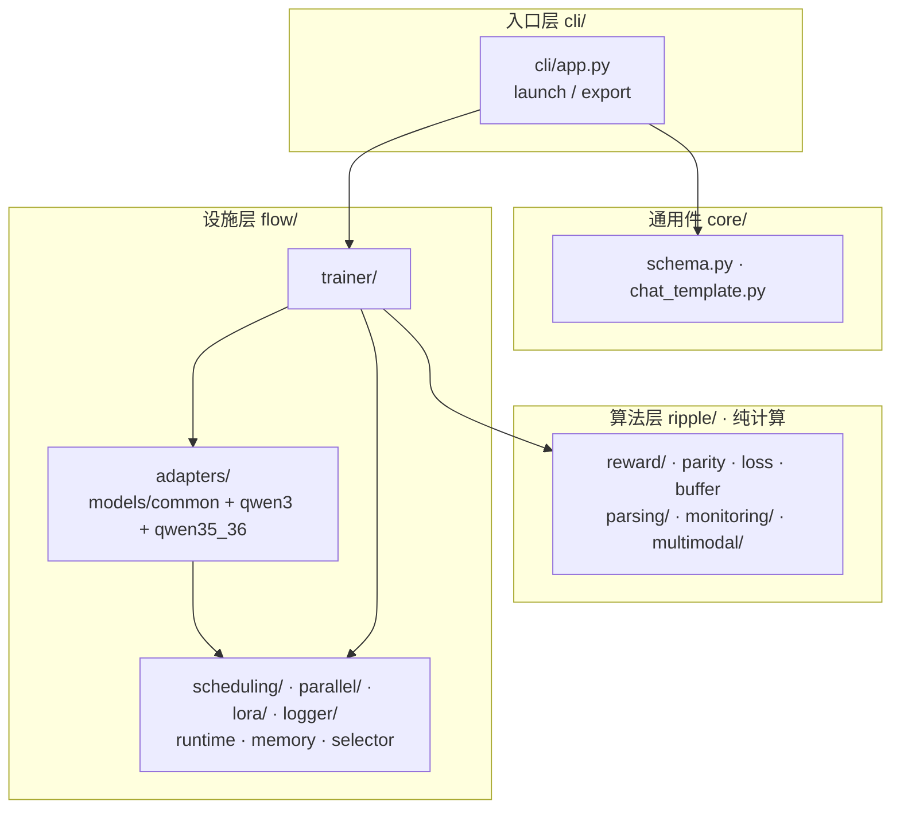
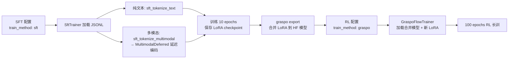
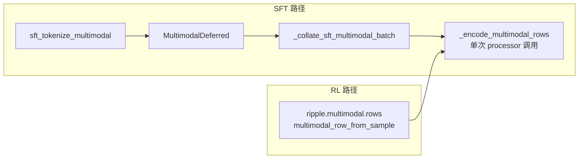
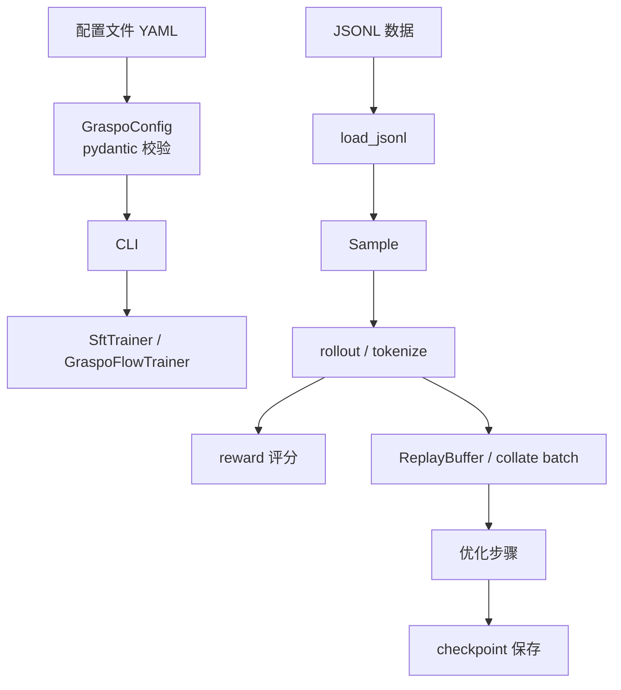

# GRASPO 架构设计

## 核心理念

GRASPO 是一个 GRPO 风格的 LoRA 强化学习训练器，面向结构化输出任务（JSON 生成、工具调用、信息抽取等）。设计遵循 BADGE 开发宪法的边界思维和防呆原则。

详细的分话题文档：
- **[GraspoFlow 后端](graspoflow.md)** — Flink 风格 TP+PP 分布式调度框架
- **[训练方法论](training_methodology.md)** — GRPO 改进版算法、奖励系统、效果评估

## 三层架构



依赖方向：`cli → trainer → adapters → scheduling/parallel`；`flow → ripple/core` 单向（设施消费算法）。

## 计算与设施分离（宪法 §1.3）

- **计算层（core/）**：纯逻辑，零 GPU/网络/IO 依赖。奖励计算、advantage 计算、结构化比较、缓冲区管理。可在单线程本地运行，可独立测试。
- **设施层（backends/graspoflow/）**：GPU 通信、TP/PP 分布式、模型加载、checkpoint 读写。唯一训练后端。

## 训练模式

GRASPO 支持两种训练模式，通过配置 `train_method` 选择：

| 模式 | train_method | 训练器 | 用途 |
|------|-------------|--------|------|
| **RL** | `graspo` | `GraspoFlowTrainer` | GRPO 风格强化学习，group-based 相对优势 |
| **SFT** | `sft` | `SftTrainer` | 监督微调，直接教模型输出 target text |

### SFT → RL 两阶段训练

典型 pipeline：先用 SFT 教模型输出格式，再用 RL 优化输出质量。



### SFT 数据格式对齐（关键不变式）

SFT 和 RL 共享同一套 JSONL 数据格式，但 target text 的生成方式不同：

- **RL**：推理时模型生成 completion → parser 解析 → 与 target 比较计算 reward
- **SFT**：`build_sft_target_text` 直接生成 XML，**不经过** `tokenizer.apply_chat_template`

**为什么不能走 chat template？** Qwen 的 chat template 在 assistant 消息前插入
`\n response\n` 前缀，但 RL 推理时 `enable_thinking=false` 的 assistant prefix 是
`<|im_start|>assistant\n`。两者不一致会导致 SFT 教的格式和模型实际输出格式错位，
模型会输出 `\n\nfunction\n response\n\n response\n` 等垃圾。

**正确做法**：`build_sft_target_text` → `_tool_calls_to_xml` 直接生成纯
`<tool_call>...</tool_call>` XML，与模型 RL 推理时的实际输出字符级一致。

### XML 格式对齐：与 Base Model 原生输出一致

仅仅"不走 chat template"还不够。Qwen3.5 在预训练中学会的 XML 工具调用格式是参数值
位于独立行：

```xml
<parameter=action_type>
逆时针旋转
</parameter>
```

而早期实现使用内联紧凑格式 `<parameter=action_type>逆时针旋转</parameter>`。
这种格式差异导致 **灾难性干扰（catastrophic interference）**：LoRA 仅 30M 参数
（模型 0.3%），被迫同时改写 XML 格式风格和内容知识。在 405 条小样本上，模型在
新旧格式间摇摆，输出崩溃的 XML（如 `<<tool_call>`、`<parameter=distance</parameter>`）。

**验证方法**：`debug_inference.py` 对 base model 推理一条纯文本 prompt，观察其
原生 XML 输出格式，然后确保 `_tool_calls_to_xml` 产出的格式与之完全一致。

**修复效果**：格式对齐后，step 1 loss 从 0.64 降至 0.28，模型不再需要为格式风格
消耗 LoRA 容量，所有参数专注于学习内容（动作名、数值）。

### 灾难性干扰与 LoRA 容量

灾难性干扰不是过拟合——过拟合是 loss 很低但泛化差。这里是 loss 也降不下去（卡在
0.15），模型处于"半吊子"状态，新旧知识混在一起。根本原因是 LoRA 容量不足以同时：
1. 改写预训练中嵌入的格式习惯
2. 学习新的领域知识

**原则**：SFT 应该只教模型**内容**（what to say），不改变**格式**（how to say）。
格式是预训练已经学会的能力，不应该被 LoRA 覆盖。如果确实需要改变格式，要么增大
LoRA 容量（r >= 64），要么考虑全量微调。

### 多模态延迟编码

SFT 多模态路径与 RL 完全对齐编码流程：



两者都通过 `_encode_multimodal_rows` 一次性完成 tokenize + 视觉编码，确保
`input_ids` 和 `pixel_values` 来自同一次 processor 调用。SFT 的 `_resolve_messages_media_paths`
和 RL 的 `_multimodal_row_from_sample(data_dir=...)` 均将相对图像路径解析为绝对路径。

## 数据流



## 为什么用 ABC 模板方法（宪法 §9.2）

每个模型族（Qwen3、Qwen3.5/3.6）有大量共享逻辑（tokenizer、chat template、batch 管理），但模型结构不同（dense vs hybrid text+vision、full-attn vs linear-attn）。ABC 基类 `TransformerAdapter` 定义流程骨架，子类只覆盖差异部分。新增模型只需定义新类并注册，零侵入现有代码。

## 为什么用类改目录（宪法 §8.3）

`GraspoFlowTrainer` 包含训练循环、rollout、优化、checkpoint 四个关注点。按功能域拆分为多个 mixin 文件后，每个文件聚焦一个概念。外部使用者通过 `__init__.py` 只 import 类名，完全不感知内部拆分。

## 为什么只有 GraspoFlow 一个后端（宪法 §16.1）

历史上有过 `native_tp` 后端。v0.9 完成 GraspoFlow 迁移后立即删除旧代码——不保留"兼容模式"，不保留 `legacy/` 目录。代码库中只存在一套当前架构。这是宪法"不留技术负债"原则的直接体现。
