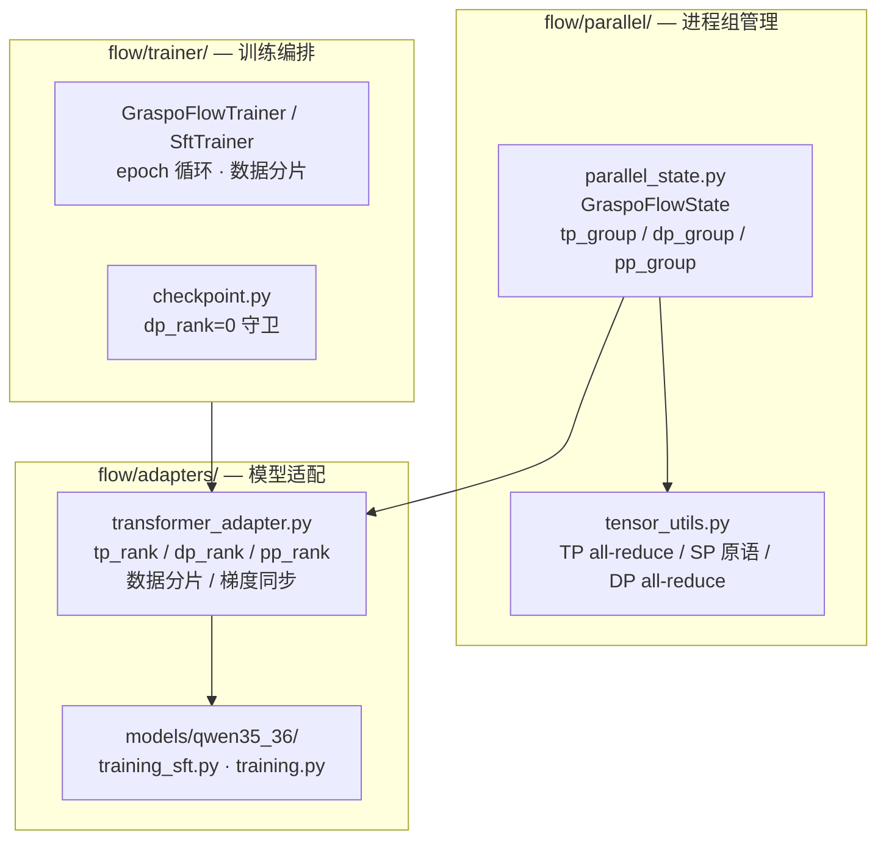
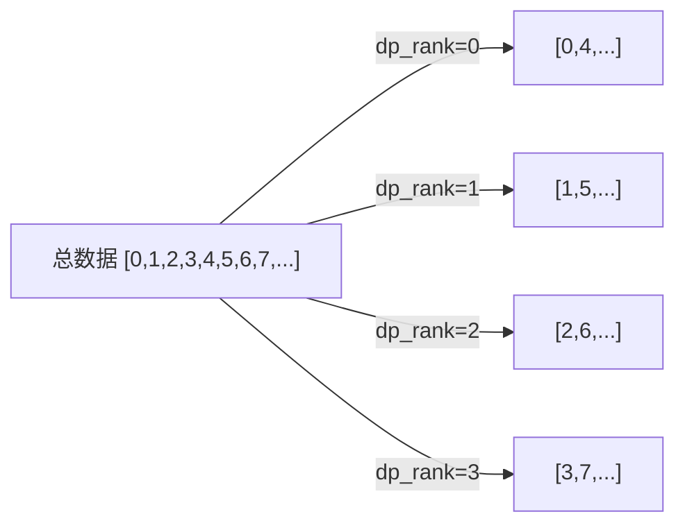
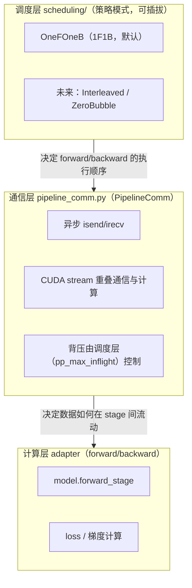
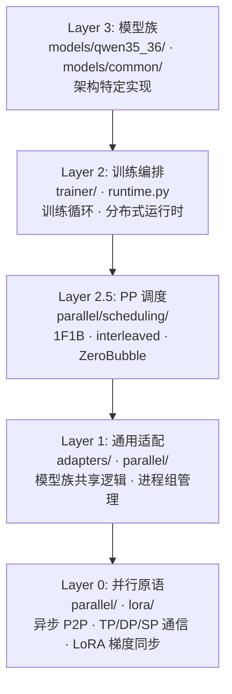

# Flow — 设施层

Flow（水流）是 GRASPO 的设施层，负责将 Ripple 的算法逻辑接入真实世界：分布式训练执行、模型加载、checkpoint 管理、训练循环编排。核心设计思想来自 Flink 等大数据分布式系统：**调度与计算分离**。

命名由来：Flow 承载数据在流水线各阶段间的持续流动——microbatch 在算子间穿梭，backpressure 调控节奏，如同水流在管道中推进。Ripple 捕获信用分配的涟漪效应，Flow 为涟漪提供流动的载体。

## 边界

- **入**：配置参数 + ripple 产出的算法结果（reward、advantage、group 决策）
- **出**：训练执行、模型权重更新、checkpoint 落盘、日志
- **职责**：GPU 通信、TP/DP/PP/SP 并行、模型加载、训练循环、checkpoint 存取
- **不碰**：算法逻辑（那是 ripple 的事）

## 五维并行架构



### 五维正交

| 维度 | 分片对象 | 通信操作 | 进程组 | 配置 |
|------|---------|---------|--------|------|
| **TP** | 模型参数（attention heads / MLP dims） | all_reduce(SUM) | `tp_group` | `tp_size` |
| **DP** | 训练数据 | all_reduce(AVG) | `dp_group` | `dp_size` |
| **PP** | 模型层 | 异步 P2P（isend/irecv）+ 背压 | `pp_group` | `pp_size` |
| **SP** | 序列维度（激活值） | reduce_scatter + all_gather | `tp_group`（复用） | `sequence_parallel` |
| **Checkpoint** | 中间激活值（重计算） | 无 | — | `gradient_checkpointing` |

### 3D 进程组拓扑

```
rank = dp_rank × (tp_size × pp_size) + pp_rank × tp_size + tp_rank

dp_rank  = rank // (tp_size × pp_size)
tp_rank  = (rank // pp_size) % tp_size
pp_rank  = rank % pp_size
world_size = dp_size × tp_size × pp_size
```

**进程组示例**（dp=2, tp=2, pp=1, 4 GPUs）：

```
          tp=0    tp=1
dp=0      rank 0  rank 1    ← tp_group[0] = {0,1}
dp=1      rank 2  rank 3    ← tp_group[1] = {2,3}

dp_group[0] = {0,2}  dp_group[1] = {1,3}
```

### DP 梯度同步

DP 梯度同步在 TP 同步**之前**、optimizer.step() **之前**执行：

```
backward loop → DP all_reduce(AVG, dp_group) → TP all_reduce(SUM, tp_group)
→ clip_grad → optimizer.step()
```

**为什么 AVG 不是 SUM**：TP rank 处理相同数据、计算部分梯度 → SUM 恢复完整梯度。DP rank 处理不同数据、计算完整梯度 → AVG 得到平均梯度。

### DP 数据分片

DP 各 rank 处理不同数据分片：



SFT：`samples[dp_rank :: dp_size]`，每个 DP rank 独立训练自己的数据分片。
RL：rollout 阶段每个 DP rank 独立采样 prompt，replay_buffer 各自管理。

### SP 与 DP

SP 复用 TP 进程组，**不受 DP 影响**。每个 DP rank 内部有自己的 TP group，SP 在该 group 内独立运作。

```
DP rank 0: [GPU 0, GPU 1] ← TP group 0（SP 在此组内）
DP rank 1: [GPU 2, GPU 3] ← TP group 1（SP 在此组内）
```

### PP 与 DP

PP 调度在每个 DP rank 内部独立运行。不同 DP rank 之间没有 PP 通信。

```
DP rank 0: [GPU 0 (stage 0), GPU 1 (stage 1)] ← PP group 0
DP rank 1: [GPU 2 (stage 0), GPU 3 (stage 1)] ← PP group 1
```

## PP 流水线架构（异步 P2P + 可插拔调度）

PP 是 Flow 设施层中最复杂的分布式形态。设计遵循 **Flink 风格的"调度与计算分离"**：
调度层决定"何时执行 forward/backward"，通信层决定"数据如何异步流动"，计算层只做模型前向/反向。

### 三层职责



### 为什么用异步 P2P 而非阻塞 send/recv

- **正确性**：阻塞式 `dist.send`/`dist.recv` 在 1F1B fill 阶段会产生时序死锁——上游 stage 的 fill 发送阻塞等待下游 stage 尚未到达的 receive。异步 `isend`/`irecv` 允许发送立即返回，接收在数据就绪后完成，**从机制上消除死锁**。
- **性能**：异步通信让计算与通信重叠（CUDA stream），是低 pipeline bubble 的前提。没有异步通信，调度只能靠"等"，bubble 无法降低。

### 背压（Backpressure）

每个 stage 维护**有界 in-flight microbatch 计数**（`pp_max_inflight_microbatches`）。当在途 microbatch 超过上限时，发送方阻塞（背压），防止显存被未消费的中间激活撑爆。这是 Flink 背压思想在训练管道中的直接映射——`memory.py` 的显存预算就是"该允许多少 microbatch 在途"的换算。

### 调度策略接口

调度策略是**可插拔的**，满足宪法 §1.2（对扩展开放，对修改关闭）：

```python
class PipelineScheduler(ABC):
    """PP 调度策略 — 决定 forward/backward 的执行顺序。

    对调度层是"时序"关注点，对通信/计算层是"何时做什么"的驱动者。
    新增调度（interleaved/ZeroBubble）只需实现本接口并注册，不改通信/计算层。
    """
    @abstractmethod
    def run(self) -> None:
        """执行一次 pipeline 调度（fill/steady/drain 或其它时序）。"""
```

- `OneFOneBScheduler`：标准 1F1B（fill → steady → drain），forward/backward 交错，低 bubble。**当前 PP 的唯一调度策略（默认）**。
- 未来策略（interleaved 1F1B / V-shape / ZeroBubble）：**在同一异步 P2P 通信层上实现**，无需重写通信或计算层。

### 通信层接口 PipelineComm

```python
class PipelineComm:
    """异步 P2P 通信管道（isend/irecv）+ 专用 CUDA stream 重叠。

    唯一职责：跨 PP stage 的 tensor 传输。不关心调度策略。
    背压由调度层用 ``pp_max_inflight_microbatches`` 控制（在途 microbatch 上限）。
    """
    def send(self, tensor: torch.Tensor, dst: int) -> Any:
        """发起 isend（非阻塞），返回 work handle。调用方需 ``wait(handle)``。"""
    def recv(self, tensor: torch.Tensor, src: int) -> Any:
        """发起 irecv（非阻塞，写入 caller 提供的 tensor），返回 work handle。"""
    def wait(self, work: Any) -> None:
        """等待指定 send/recv work 完成（在读取/复用 tensor 前调用）。"""
```

### 模块结构

```
src/graspo/flow/parallel/
├── __init__.py            # 对外开放 API
├── parallel_state.py      # 3D rank 拓扑（dp × tp × pp）
├── tensor_utils.py        # TP/SP/DP 原语
├── pipeline_comm.py       # PipelineComm — 异步 P2P 通信 + CUDA stream 重叠（设施层）
└── scheduling/            # 调度层（策略模式）
    ├── __init__.py        # 重导出 PipelineScheduler + 工厂
    ├── base.py            # PipelineScheduler ABC（契约）
    ├── one_f_one_b.py     # OneFOneBScheduler（1F1B，默认）
    └── factory.py         # 按配置构建调度策略（预留 interleaved 等）
```

### Checkpoint 与 DP

- **保存**：每个 DP rank 都写自己的 shard（权重梯度已同步；LoRA/optimizer/RNG/调度器
  状态各 rank 独立保存）
- **加载**：每个 DP rank 从共享文件系统读回自己的 shard（`map_location=self.device`），
  不做 object-collective 广播——广播会保留 sender 的 CUDA device index 并让接收 rank
  的 optimizer state 停在 cuda:0，造成显存不均与每 GPU 多进程
- **RNG 状态**：每个 DP rank 的 RNG 状态不同（不同数据分片），resume 时各 rank 读回
  自己的 shard 即可各自恢复

## 四层架构



### Layer 0：并行原语

- **parallel_state.py**：`GraspoFlowState` 管理 tp/dp/pp 三个进程组和 3D rank 拓扑
- **tensor_utils.py**：TP all-reduce、SP reduce_scatter/all_gather/scatter、DP all-reduce
- **pipeline_comm.py**：`PipelineComm` — 异步 isend/irecv + CUDA stream 重叠（Flink 风格通信）
- **lora_linear.py**：`_sync_nonsharded_lora_grads`（TP SUM）+ `_sync_dp_lora_grads`（DP AVG）

### Layer 2.5：PP 调度

- **scheduling/base.py**：`PipelineScheduler` ABC — 调度策略契约（时序关注点）
- **scheduling/one_f_one_b.py**：`OneFOneBScheduler` — 标准 1F1B（fill/steady/drain）
- **scheduling/factory.py**：按配置构建调度策略（预留 interleaved / ZeroBubble）

### Layer 1：通用适配

- **transformer_adapter.py**：所有模型族的共享基类。`_setup_distributed()` 初始化 3D 并行状态，`_shared_training_indices()` 在 DP group 内广播 shuffle 索引
- **placement.py**：`NativePlacementPlan` 决定每层放到哪个 PP stage，DP 不影响 placement

### Layer 2：训练编排

- **GraspoFlowRuntime**：运行时入口，初始化并行状态、加载模型权重
- **GraspoFlowTrainer**：RL 训练循环主类，通过 mixin 组合（RolloutMixin、OptimizeMixin、CheckpointMixin）
- **SftTrainer**：SFT 训练循环，DP 数据分片在 epoch 循环中完成

### Layer 3：模型族

每个模型族在 `models/` 下有独立目录（如 `qwen35_36/`），包含 adapter（TransformerAdapter 子类）、model（causal LM wrapper）、training（TP/DP/PP 训练循环）。公共层在 `models/common/` 中按模型族拆分。当前受支持的模型族为 Qwen3.5 / Qwen3.6 hybrid text/vision 家族。

## 插件化适配

新增模型族只需：定义 `TransformerAdapter` 子类 → 实现模型特定的 forward/generation 钩子 → 注册到模型注册表。零侵入现有代码，不修改任何 flow 核心逻辑。

## TP LoRA 梯度同步

TP 模式下，所有 rank 处理相同数据并各自计算部分梯度。完整梯度是各 rank 部分梯度之和（SUM，非 DDP 的平均值）：

- `lora_a`（input projection）：权重非分片，TP rank 间共享 → 梯度需 SUM all-reduce
- `lora_b`（output projection）：按 output dimension 分片 → 每个 rank 只负责自己的分片维度，**不需要同步**

## DP LoRA 梯度同步

DP 模式下，各 rank 处理不同数据并各自计算完整梯度。`dp_replicate_lora=true`（默认）时，每个 DP rank 有独立的 LoRA 副本，梯度需 AVG all-reduce 跨 DP group。

同步顺序：**DP(AVG) → TP(SUM) → clip_grad → optimizer.step()**。DP 先同步确保所有 DP rank 的梯度一致，TP 再修正非分片 LoRA 的部分梯度。

## KV Cache 策略

Rollout 生成阶段支持两种路径，通过 `model.supports_kv_cache` 属性在运行时选择：KV cache 路径（默认，逐 token decode 复用已计算的 KV 对）和 Full forward 路径（fallback，每次 decode 完整 forward）。

## Placement 策略

`NativePlacementPlan` 决定每层放到哪个 pipeline stage。默认策略：`qwen3_tp`（对 Qwen3.5/3.6 hybrid text/vision 家族优化的均匀分布）、`auto`（基于层数的均匀划分）、手动（通过 `layer_ranges` 精确控制）。

## 统一 TP+DP+PP+SP

GraspoFlow 将五维并行统一在一个框架下：`dp=1,tp=1,pp=1`（单卡）到 `dp=D,tp=T,pp=P`（全并行）。用户只需在配置文件中设 `tp_size`、`dp_size`、`pp_size` 和 `sequence_parallel`，不需要理解后端差异。SP 在 TP>=2 时可选启用，自动复用 TP 进程组。Checkpoint 默认开启，用户无需配置。

PP 的流水线架构（异步 P2P + 可插拔调度）对用户透明——调度策略和通信细节由框架管理，用户只配置 `pp_size`（以及可选的 `pp_max_inflight_microbatches` 背压上限）。

## 负载均衡与单进程/卡

- **每个 GPU 只运行一个训练进程**：`launch.nproc_per_node` 从 `dp_size × tp_size × pp_size` 推导，torchrun 按 world_size 启动等量 worker；`parallel_state` 以 `device_id=cuda:local_rank` 绑定默认通信组，避免 NCCL 默认组缓冲集中到 cuda:0 造成显存不均，并在 `local_rank ≥ 可见 GPU 数` 时直接报错（防多进程/卡）。
- **PP 层放置尽力均衡**：`NativePlacementPlan` 用 minimax 让每个 stage 的加权计算负载最小（`placement.py`），DP 数据分片按 rank 均匀切分。
- **逐卡显存对称是设计目标**：TP/PP/SP 下各 rank 的激活分片天然不同，故"逐卡显存基本一致"是**目标而非强不变量**；实现与验证方式（如 `rank_metrics` 每 rank 峰值显存断言）见实现计划与测试矩阵。在 4 卡 A800 验证节点上，DP=4 SFT 长训已实测逐卡显存基本一致（~160 MiB 内）。

## PP 设计决策记录

- **1F1B 是唯一调度（默认）**：GPipe（全 forward → 全 backward）bubble 最高且不重叠 forward/backward，且在双向进程组 + 显式 tag + 背压机制下 1F1B 已实测可用且更快（PP=4 冒烟 38.50s < 45.94s）。按宪法 §18.1 旧 GPipe 已删除，代码库只保留当前架构。
- **1F1B 依赖异步 P2P**：1F1B（forward/backward 交错）需异步 P2P 且要求 forward-hidden 与 backward-grad 走**独立通道**（否则同一 peer-pair 单 FIFO 双向消息交错会死锁）。当前实现已用双向进程组 + 显式 tag + 背压。
- **调度策略可插拔**：`OneFOneBScheduler` 只是调度层的第一个实现。未来 interleaved 1F1B / V-shape / ZeroBubble 在**同一异步 P2P 通信层**上作为新策略实现，无需改动通信或计算层。
- **Flink 思想映射**：
  - Operator → PP stage（若干层的计算单元）
  - Edge → PipelineComm（异步 isend/irecv）
  - Scheduler → PipelineScheduler（执行时序）
  - Backpressure → `pp_max_inflight_microbatches`（有界 in-flight 队列）
  - 与 Flink 的差异：PP 训练含 backward，反向梯度沿 stage 逆流，无法像纯 forward 流式那样近乎零 bubble。bubble 只能靠调度策略（1F1B/interleaved）降低，不能消除。