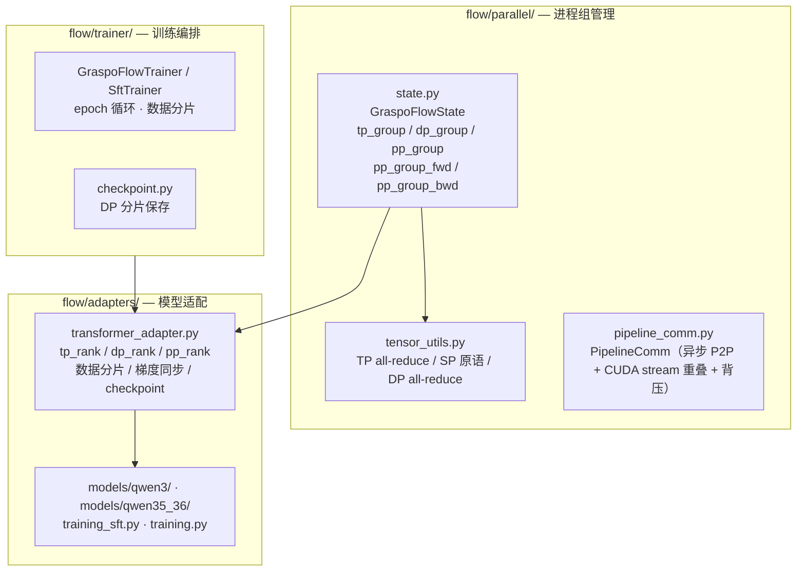
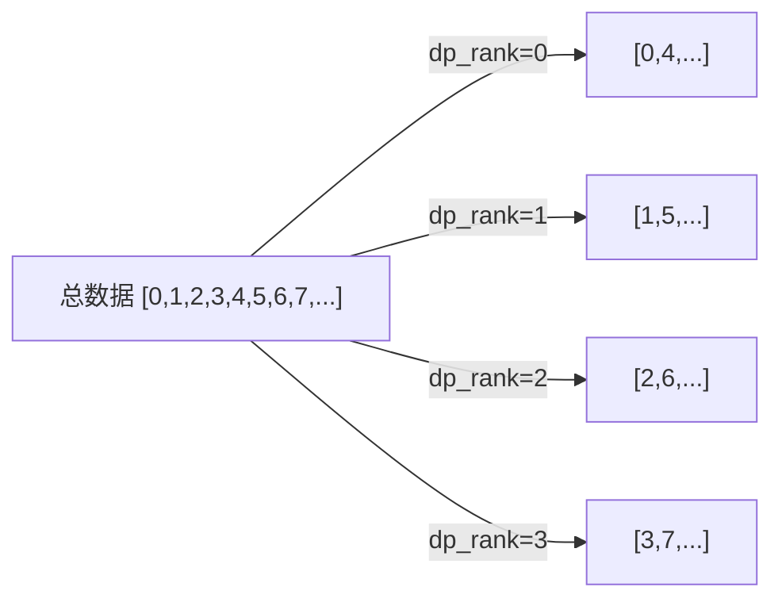
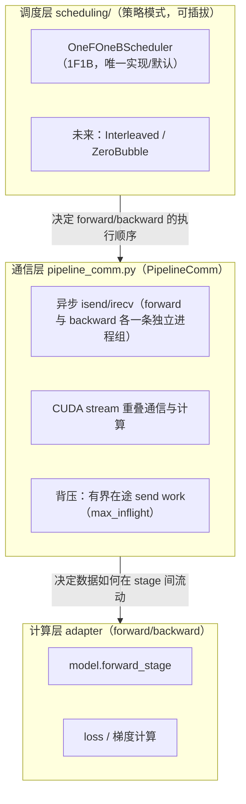

# Flow — 设施层

Flow（水流）是 GRASPO 的设施层，负责将 Ripple 的算法逻辑接入真实世界：**后端选择与执行链路分派**、分布式训练执行、模型加载、checkpoint 管理、训练循环编排。核心设计思想来自 Flink 等大数据分布式系统：**调度与计算分离**。

命名由来：Flow 承载数据在流水线各阶段间的持续流动——microbatch 在算子间穿梭，backpressure 调控节奏，如同水流在管道中推进。Ripple 捕获信用分配的涟漪效应，Flow 为涟漪提供流动的载体。

> 本文只描述 **Flow 设施层**。算法语义（reward / advantage / group 决策）见 `docs/ripple.md`；跨层架构与 DeepSpeed 硬约束的完整论述见 `docs/architecture.md` §3。

## 边界

- **入**：配置参数（`GraspoConfig`）+ ripple 产出的算法结果（reward、advantage、group 决策）
- **出**：后端选择结果、训练执行、模型权重更新、checkpoint 落盘、日志
- **职责**：后端注册与分派、GPU 通信、TP/DP/PP/SP 并行、模型加载、训练循环、checkpoint 存取
- **不碰**：算法逻辑（那是 ripple 的事）；ms-swift 内部实现（那是 msswift 后端的依赖）

---

## 1. 双后端架构（native / msswift）

Flow 不是单一执行载体：同一套配置与算法核（`ripple`）可以跑在两条执行链路上。

| 后端 | 执行载体 | 实现位置 | 并行网格 |
|------|---------|---------|---------|
| `native` | 自持 PyTorch 分布式运行时（不 import Megatron/vLLM/Ray/DeepSpeed/FSDP/Accelerate） | `src/graspo/flow/runtime.py`、`flow/parallel/`、`flow/trainer/`、`flow/adapters/` | `dp_size × tp_size × pp_size`（`native.*`） |
| `msswift` | ms-swift 作为库（进程内 Python API），只注入 graspo 算法核 | `src/graspo/flow/msswift/` | `msswift.nproc_per_node` / DeepSpeed / FSDP / Megatron（由上游决定） |

`native` 后端的依赖边界是**运行时强断言**，不是口头声明：`flow/runtime.py:69-78` 列出 `FORBIDDEN_RUNTIME_MODULES`（`megatron` / `nemo_rl` / `vllm` / `ray` / `deepspeed` / `accelerate` / `transformer_engine` / `apex`），`GraspoFlowRuntime.validate()` 在 setup 前调用 `assert_forbidden_runtime_modules_not_imported()`（`flow/runtime.py:237-239, 613-618`），一旦这些模块已被 import 即 fail-closed（`flow/runtime.py:206-212` 声明同一事实）。

### 1.1 后端注册表与选择规则

- **注册**：后端通过 setuptools entry_points 声明（`pyproject.toml:70-72`）：

  ```toml
  [project.entry-points."graspo.backends"]
  native  = "graspo.flow.backend_selection:create_native_trainer"
  msswift = "graspo.flow.msswift.trainer:create_msswift_trainer"
  ```

  开发模式（未 `pip install`）回退到 `core/discovery.py:21-53` 的 `_DEV_FALLBACKS`；两条来源同构，见 `select_backend` 的 `SUPPORTED_BACKENDS`（`flow/backend_selection.py:13`）。

- **选择**：`select_backend(config, requested=None)`（`flow/backend_selection.py:26-42`）取 `requested or config.backend or "native"`（**默认 native**），后端名不在注册表即抛 `ValueError`（`:28-32`）。

- **训练方法 × 后端**：合法组合由配置加载期校验，**单一真相源**是 `core/schema.py:29-34`：

  | `train_method` | native | msswift |
  |------|:---:|:---:|
  | `graspo`（GRASPO / RL） | ✅ | ✅ |
  | `sft`（监督微调） | ✅ | ✅ |
  | `cpt`（继续预训练） | ⛔ | ✅ |
  | `opd`（on-policy 蒸馏 / GKD） | ⛔ | ✅ |

  CPT / OPD 在 native 侧不存在实现，配置期即 fail-closed 拒绝（`core/schema.py:25-34, 67-105`），而不是静默路由到别的训练器。`train_method` 枚举本身是 `core/schema.py:23`。

- **路由真相源**：`(train_method, backend)` → 训练器工厂由 `_REGISTRY_BY_TRAIN_METHOD` 解析（`core/discovery.py:58-63`），四种算法各查自己的注册表（`graspo.backends` / `graspo.sft_backends` / `graspo.cpt_backends` / `graspo.opd_backends`）。工厂形状统一为 `factory(config, selection) -> 含 train(smoke) 的训练器`。

  > **文档 vs 代码差异（以代码为准）**：`cli/train_worker.py:6-8` 称四张注册表"都在 `pyproject.toml` 的 entry_points 里声明"，但 `pyproject.toml` 只声明了 `graspo.rewards` / `graspo.adapters` / `graspo.backends` 三组（`:63, 66, 70`）；`graspo.sft_backends` / `graspo.cpt_backends` / `graspo.opd_backends` **只存在于** `core/discovery.py:37-52` 的 `_DEV_FALLBACKS`。由于 `_discover` 在 entry_points 为空时回退到该表（`core/discovery.py:97-102`），四张注册表在开发与安装环境下都可达，但"生产真相源 = entry_points"这一说法对后三组不成立。

### 1.2 执行链路（后端分支）

1. **启动**：`graspo launch` → `cmd_launch`（`cli/app.py:117-144`）→ `build_launch_plan`（`cli/app.py:146-213`）。
2. **后端分支**：
   - `native`：由 `dp_size × tp_size × pp_size` 推导 `nproc_per_node`（`cli/app.py:301-322`，`_native_world_size` 见 `:351`），经 torchrun 拉起 `graspo.cli.train_worker`。
   - `msswift`：`build_launch_plan` 在 `cli/app.py:158-165` 转交 `_build_msswift_launch_plan`（`:215-299`）；进程数真源为 `msswift.nproc_per_node`，否则回落 `launch.nproc_per_node`（`:254-257`）。**命令入口与 native 同形**（同一个 `train_worker`），差别只在并行层：ms-swift 通过 `import swift` 作库在**本进程内**完成训练，没有子进程、没有 shell，不把 graspo YAML 喂给 ms-swift CLI（`cli/app.py:215-243`、`flow/msswift/trainer.py:6-16`）。
3. **worker 分派**：`train_worker.main` 只做一件事——`resolve_backend_builder(selection.name, train_method=config.train_method)` 后调 `builder(config, selection).train(smoke=...)`（`cli/train_worker.py:141-142`）。本文件不按算法分支；新增算法/后端不改本文件（`cli/train_worker.py:1-20`）。

### 1.3 msswift 后端的分层

`flow/msswift/` 内部按一事一责拆分（`flow/msswift/__init__.py:1-16`）：

- `trainer.py` — RL(GRPO) 训练器与 `graspo.backends` 工厂（算法注入点）
- `sft_trainer.py` / `cpt_trainer.py` / `opd_trainer.py` — SFT / CPT / OPD 入口与各自注册表工厂
- `dataset.py` — graspo/ARD JSONL → ms-swift 数据集（SFT/GRPO/CPT/OPD 四形态）
- `_config_mapping.py` — graspo 配置 → ms-swift 参数（纯计算）
- `reward.py` — graspo 奖励在 ms-swift 奖励通道上的适配器
- `adapter.py` / `_ard_contract.py` — ARD ↔ graspo 数据契约

算法注入路线：把 graspo 的 GRPO 训练器注册到 ms-swift 的 `TrainerFactory.TRAINER_MAPPING["grpo"]`（`flow/msswift/plugin.py:40`，点分路径，`get_cls` 用 `rsplit('.', 1)` 切分，见 `:12-15`），只替换算法方法，保留 ms-swift 的训练循环与基础设施（`flow/msswift/trainer.py:90` 起的 `GraspoMsSwiftGRPOTrainer`）。

---

## 2. ★ 硬约束：禁用 DeepSpeed（用户 2026-09-27 指令）

> **条款（强制）**：GRASPO 今后**不得使用 DeepSpeed**。并行需求改用 **ms-swift 的 Megatron / FSDP 模块**，或**开发 native 后端**替代。

**理由（grad_norm 守卫/计数不可信）**：

1. `accelerate` 的梯度裁剪路径对 DeepSpeed 直接返回引擎读数，**不做裁剪**：
   `clip_grad_norm_` 的 DeepSpeed 分支（`accelerate/accelerator.py:2982-2986`）为
   `return self.deepspeed_engine_wrapped.get_global_grad_norm()`（return 在 `:2985`）；
   FSDP 分支 `:2971-2981`，默认路径 `:3006-3007` 才走 `torch.nn.utils.clip_grad_norm_`。
2. DeepSpeed 在 `optimizer.step()` **之后**才给 `_global_grad_norm` 赋值；ZeRO 溢出分支提前返回、不计算范数 ⇒ 在 `step()` **之前**取读数的调用方可能拿到**上一步的陈旧值**。上游有同类反馈：ms-swift issue #3930（⚠ **上游引用，本仓无法复核**，见 §12 B 档）。
3. 本仓把 `grad_norm` 当验收证据（A6 判据"loss 与 grad_norm 全程 finite"），范数一旦陈旧/缺失，验收判据与能力矩阵判据就失去鉴别力——这是**防线失效**，不是性能取舍。

> **证据归属与版本**：第 1 条的 accelerate 行号来自**与目标 228 镜像逐字节一致**的下游副本
> `.local/hb-workspace/20260923-analysis/task-msswift-naninf-study/src/accelerate_accelerator.py`
> ⚠ **该 `.local/` 路径是内部工位留证，不随仓库发布**（公开读者无法跟读）；行号结论已在上文自包含给出，不依赖该路径。
> （accelerate **1.14.0**，4359 行，sha256 `47088e0ab3bf21eec97e16afa14595e1db511f6ead9ab85c4eaa5f6f66fe5e61`）。
> `accelerate` 本身不在本仓依赖内，行号是对该副本复核的结果，不是用上游 wheel 直接核的。
> 补充事实：`clip_grad_value_`（def `:3009`）对 DeepSpeed/FSDP 抛"不支持"异常，位置在 `:3031-3032`。

**落位（本文档相关章节）**：

- **后端选择规则（§1.1）**：新配置 / 新矩阵档位 / 新示例**一律不得**把 `backend: msswift` 与 DeepSpeed 系列参数组合使用；需要并行时选 `native`（§2）或 ms-swift 的 FSDP/Megatron 通道。
- **执行流程的后端分支（§1.2）**：`msswift` 分支的合法并行参数为 `msswift.fsdp`（`core/schema.py:763`）与 `msswift.megatron.*`（`core/schema.py:671-723, 799`），不是 DeepSpeed。

**现状（如实声明，非推荐用法）**：代码里的 DeepSpeed 接线**尚未删除**，属迁移遗留：

| 位置 | 字段 | 消费点 |
|------|------|--------|
| msswift 标准通道 | `msswift.deepspeed`（S3 ZeRO） | `core/schema.py:757` → `--deepspeed`，`flow/msswift/_config_mapping.py:168` |
| msswift | `msswift.zero_hpz_partition_size`（S4 ZeRO++） | `core/schema.py:759` → `_config_mapping.py:169` |
| msswift | `msswift.deepspeed_autotp_size`（S5 AutoTP，仅全参） | `core/schema.py:761` → `_config_mapping.py:170` |
| msswift 蒸馏 | `distill.teacher_deepspeed` | `core/schema.py:531` → `_config_mapping.py:567` |
| 后端说明字符串 | `select_backend` 的 msswift reason 仍写 "Megatron/DeepSpeed/vLLM" | `flow/backend_selection.py:36` |
| 全参 TP 建议文案 | 仍建议 `msswift.deepspeed_autotp_size` | `core/schema.py:153-154, 171-172` |

⇒ 上述 DeepSpeed 相关流程描述**已废弃**（deprecated）；字段目前仍是合法配置项（无 validator 拒绝），迁移完成前不得据此认为"仍推荐 DS"。替代路径的代码现状（native 已实现；FSDP/Megatron 属半成品、未见端到端证据）见 `docs/architecture.md` §3.2–§3.3。

> **核实边界（如实声明）**：accelerate 的行号已用上文的同源副本复核（sha256 一致）；但该副本**不是**本仓依赖，本仓也不 pin accelerate 版本 ⇒ 若上游发布新版本，这些行号可能漂移。ms-swift issue #3930 仍为**上游引用，本仓无法复核**。

---

## 3. 五维并行架构（native 后端）

> 以下全部为 `native` 后端的实现事实。`msswift` 后端的并行网格由上游（FSDP/Megatron）决定，不使用本节的进程组模型。



### 3.1 五维正交

| 维度 | 分片对象 | 通信操作 | 进程组 | 配置 |
|------|---------|---------|--------|------|
| **TP** | 模型参数（attention heads / MLP dims） | all_reduce(SUM) | `tp_group` | `tp_size` |
| **DP** | 训练数据 | all_reduce(AVG) | `dp_group` | `dp_size` |
| **PP** | 模型层 | 异步 P2P（isend/irecv）+ 背压 | `pp_group` + `pp_group_fwd`/`pp_group_bwd` | `pp_size` |
| **SP** | 序列维度（激活值） | reduce_scatter + all_gather | `tp_group`（复用） | `sequence_parallel` |
| **Checkpoint** | 中间激活值（重计算） | 无 | — | `gradient_checkpointing` |

配置字段定义在 `core/schema.py:546-668`（`tp_size` / `dp_size` / `pp_size` 见 `:555-557`）；`GraspoFlowConfig` 的 docstring 即"TP+DP+PP+SP+Checkpoint 五位一体"。`gradient_checkpointing` 默认 `True`（`core/schema.py:279`）。

### 3.2 3D 进程组拓扑

配对的真实公式（`flow/parallel/state.py:3-9`，实现见 `:103-108`）：

```
rank = dp_rank × (tp_size × pp_size) + pp_rank × tp_size + tp_rank

dp_rank  = rank // (tp_size × pp_size)
pp_rank  = (rank % (tp_size × pp_size)) // tp_size
tp_rank  = (rank // pp_size) % tp_size
world_size = dp_size × tp_size × pp_size
```

`world_size` 必须严格等于 `dp_size × tp_size × pp_size`，否则 fail-closed（`flow/parallel/state.py:97-102`）。

**进程组构造**（`flow/parallel/state.py:115-151`）：`tp_group` 取同 `(dp_rank, pp_rank)` 的 rank；`dp_group` 取同 `(tp_rank, pp_rank)` 的 rank；`pp_group` 取同 `(dp_rank, tp_rank)` 的 rank；`pp_size > 1` 时另建两个**同 rank 序列**的独立进程组 `pp_group_fwd` / `pp_group_bwd`（`:134-144`）。

**进程组示例**（dp=2, tp=2, pp=1, 4 GPUs）：

```
          tp=0    tp=1
dp=0      rank 0  rank 1    ← tp_group[0] = {0,1}
dp=1      rank 2  rank 3    ← tp_group[1] = {2,3}

dp_group[0] = {0,2}  dp_group[1] = {1,3}
```

### 3.3 DP 梯度同步

DP 梯度同步在 TP 同步**之前**、`optimizer.step()` **之前**执行：

```
backward loop → DP all_reduce(AVG, dp_group) → TP all_reduce(SUM, tp_group)
→ clip_grad → optimizer.step()
```

代码证据：非 PP 路径 `flow/adapters/models/qwen35_36/training.py:160, 163, 165, 173`；PP 路径 `:440, 442, 446, 455`。同步顺序在实现处被逐字声明（`flow/lora/lora_linear.py:264-266`）。

**为什么 AVG 不是 SUM**：TP rank 处理相同数据、计算部分梯度 → SUM 恢复完整梯度。DP rank 处理不同数据、计算完整梯度 → AVG 得到平均梯度（`flow/lora/lora_linear.py:220-228, 258-263`）。

> 注意：以上梯度同步实现**只覆盖 LoRA 参数**（`flow/lora/lora_linear.py` 的 `_sync_dp_lora_grads` / `_sync_nonsharded_lora_grads`）。这是 native **全参只支持 PP** 的原因——`tp_size>1` 或 `dp_size>1` 的全参配置在加载期被拒绝（`core/schema.py:148-173`）。

### 3.4 DP 数据分片

DP 各 rank 处理不同数据分片：



- RL：epoch 样本按 `epoch_samples[self.adapter.dp_rank :: self.adapter.dp_size]` 分片（`flow/trainer/trainer.py:245-247`），每个 DP rank 有独立的 `ReplayBuffer` 实例（`flow/trainer/trainer.py:66`）。
- SFT：同一 DP 分片口径，DP rank 独立训练自己的数据分片。
- **同一 dp_rank 内的训练索引靠本地确定性 shuffle 对齐，不做跨 rank 广播**：`_shared_training_indices`（`flow/adapters/transformer_adapter.py:679-698`）用确定性种子在本地 shuffle，各 rank 无需通信。

### 3.5 SP 与 DP

SP 复用 TP 进程组（`_set_tensor_parallel_group` 在 `flow/adapters/transformer_adapter.py:385` 用 `state.tp_group` 初始化；SP 原语 `_reduce_scatter_sp` / `_scatter_sp` / `_all_gather_sp` 见 `flow/parallel/tensor_utils.py:237, 263, 281`），**不受 DP 影响**。每个 DP rank 内部有自己的 TP group，SP 在该 group 内独立运作。

`sequence_parallel` 是**显式开关**（默认 `False`，`core/schema.py:566`），要求 `tp_size >= 2`，否则 `validate_native_runtime_config` 拒绝（`flow/runtime.py:404-405`）。消费点：`flow/adapters/models/qwen35_36/adapter.py:81`。

```
DP rank 0: [GPU 0, GPU 1] ← TP group 0（SP 在此组内）
DP rank 1: [GPU 2, GPU 3] ← TP group 1（SP 在此组内）
```

### 3.6 PP 与 DP

PP 调度在每个 DP rank 内部独立运行。不同 DP rank 之间没有 PP 通信。

```
DP rank 0: [GPU 0 (stage 0), GPU 1 (stage 1)] ← PP group 0
DP rank 1: [GPU 2 (stage 0), GPU 3 (stage 1)] ← PP group 1
```

---

## 4. PP 流水线架构（异步 P2P + 可插拔调度）

PP 是 Flow 设施层中最复杂的分布式形态。设计遵循 **Flink 风格的"调度与计算分离"**：
调度层决定"何时执行 forward/backward"，通信层决定"数据如何异步流动"，计算层只做模型前向/反向。

### 4.1 三层职责



### 4.2 为什么用异步 P2P 而非阻塞 send/recv

- **正确性**：阻塞式 `dist.send`/`dist.recv` 在 1F1B fill 阶段会产生时序死锁——上游 stage 的 fill 发送阻塞等待下游 stage 尚未到达的 receive。异步 `isend`/`irecv` 允许发送立即返回，接收在数据就绪后完成（`flow/parallel/scheduling/one_f_one_b_scheduler.py:14-16`）。
- **性能**：异步通信让计算与通信重叠（专用 CUDA stream + 事件显式同步），是低 pipeline bubble 的前提（`flow/parallel/pipeline_comm.py:17-22`）。

### 4.3 双向进程组（fwd / bwd 独立通道）

1F1B 把 forward-hidden 与 backward-grad 交错到**同一 peer-pair**上。若两者共用同一进程组，NCCL 在同 peer-pair 上是单 FIFO 配对的，两个方向按不同速率出现即错配死锁。解法：为每个 PP group 另建 `pp_group_fwd` / `pp_group_bwd` 两个同 rank 序列的独立进程组，各得一条独立 NCCL P2P channel（`flow/parallel/state.py:46-49, 134-144`；`flow/parallel/pipeline_comm.py:7-16`）。

**关键契约事实**：`dist.isend/irecv` 的 `tag` 在 NCCL 后端**不生效**（PyTorch 文档原文 "tag is not supported with the NCCL backend"）。因此 fwd/bwd 的隔离**只**来自两个独立进程组；`PipelineComm._validate_tag` 只保证调用方传的 tag 与方向自洽，**不是**顺序配对的保护（`flow/parallel/pipeline_comm.py:46-50,211`）。

### 4.4 背压（Backpressure）

背压由**通信层**实现，不是调度层：`PipelineComm` 维护**有界在途 send work**（`max_inflight`），上限由 `native.pp_max_inflight_microbatches` 给出；`max_inflight <= 0` 表示无界（单测/调试用，也是默认值 `0`，见 `core/schema.py:608`）。背压防止未消费的中间激活/梯度撑爆显存，也防止 1F1B 交错下超窗死锁（`flow/parallel/pipeline_comm.py:5-8, 189-203`）。

> **未接线说明（如实声明）**：`flow/memory.py` 提供 `estimate_per_microbatch_activation_bytes` / `compute_max_inflight`（按空闲显存把"多少 microbatch 可在途"换算成整数，`flow/memory.py:13-81`），但在 `src/` 内**没有消费点**（grep 仅命中定义本身）——它尚未自动喂给 `pp_max_inflight_microbatches`。训练侧上报的 `pipeline_inflight_bound_source` 恒为 `"optimizer_step_chunks"`，即实际在途上界由"每 optimizer step 的 chunk 数"与配置上限的较小值决定（`flow/adapters/models/qwen35_36/training.py:478-480, 508`）。

### 4.5 调度策略接口

调度策略是**可插拔的**，满足宪法 §1.2（对扩展开放，对修改关闭）：

```python
class PipelineScheduler(ABC):
    """PP 调度策略 — 决定 forward/backward 的执行顺序。

    对调度层是"时序"关注点，对通信/计算层是"何时做什么"的驱动者。
    新增调度（interleaved/ZeroBubble）只需实现本接口并注册，不改通信/计算层。
    """
    @abstractmethod
    def run(self) -> dict[str, Any]:
        """执行一次 pipeline 调度，返回调度统计（如 fill/steady/drain 耗时）。"""
```

（`flow/parallel/scheduling/pipeline_scheduler.py:15-48`）

- `OneFOneBScheduler`：标准 1F1B（fill → steady → drain；`warmup = min(pp_size - pp_rank - 1, num_chunks)`），返回 `pp_schedule` / `pipeline_fill_sec` / `pipeline_steady_sec` / `pipeline_drain_sec`（`flow/parallel/scheduling/one_f_one_b_scheduler.py:27-65`）。**当前 PP 的唯一调度策略（默认）**。
- 工厂：`build_scheduler(...)` 的注册表 `{"one_f_one_b": ..., "1f1b": ...}`，空名/`default`/`auto` 走 1F1B（`flow/parallel/scheduling/factory.py:15-18, 44-53`）。配置字段 `native.pp_scheduler`（`core/schema.py:662`）。
- 未来策略（interleaved 1F1B / V-shape / ZeroBubble）：**在同一异步 P2P 通信层上实现**，无需重写通信或计算层。

### 4.6 通信层接口 PipelineComm

实际 API 是**方向分离**的四组原语 + work handle，而非单一 `send`/`recv`：

```python
class PipelineComm:
    """异步 P2P 通信管道（isend/irecv）+ 专用 CUDA stream 重叠 + 有界在途背压。

    唯一职责：跨 PP stage 的 tensor 传输。不关心调度策略。
    """
    def fwd_send(self, tensor, dst, *, tag=0) -> Any: ...   # forward 通道发送
    def fwd_recv(self, tensor, src, *, tag=0) -> _RecvHandle: ...
    def bwd_send(self, tensor, dst, *, tag=0) -> Any: ...   # backward 通道发送
    def bwd_recv(self, tensor, src, *, tag=0) -> _RecvHandle: ...
    def wait(self, work, *, label="") -> None: ...          # 等单个 work
    def wait_all(self, works, *, label="") -> None: ...     # 等一批 work
```

（`flow/parallel/pipeline_comm.py:131-343`；构造参数 `fwd_group` / `bwd_group` / `max_inflight` / `wait_timeout_s` 见同文件 `:57-70` 的用法示例。）

- **有界等待（缺陷 P6 的 a1）**：`wait()` / `wait_all()` 支持超时，超时抛具名 `PipelineP2PTimeoutError`（`flow/parallel/pipeline_comm.py:78-116, 366-490`）。作用域**只准用于 PP rollout / 生成路径**（键 `native.pp_rollout_p2p_timeout_sec`，`core/schema.py:611-625`）；禁止用于 1F1B 训练热路径，训练路径的有界性由 NCCL watchdog 提供。
- **会合点看门狗**：CUDA 流/事件依赖上的阻塞没有在飞 work 可超时，由 `flow/parallel/rendezvous_watchdog.py` 兜底（键 `native.pp_rollout_no_progress_sec`，`core/schema.py:626-634`）。

### 4.7 模块结构

```
src/graspo/flow/parallel/
├── __init__.py
├── state.py                    # GraspoFlowState — 3D rank 拓扑（dp × tp × pp）+ 进程组
├── tensor_utils.py             # TP/SP/DP 原语 + collate/生成辅助
├── pipeline_comm.py            # PipelineComm — 异步 P2P + CUDA stream 重叠 + 背压
├── placement_plan.py           # NativePlacementPlan — 层放置规划
├── rendezvous_watchdog.py      # PP rollout 无进展看门狗
└── scheduling/                 # 调度层（策略模式）
    ├── __init__.py             # 重导出 PipelineScheduler / OneFOneBScheduler / build_scheduler
    ├── pipeline_scheduler.py   # PipelineScheduler ABC（契约）
    ├── one_f_one_b_scheduler.py# OneFOneBScheduler（1F1B，默认/唯一）
    └── factory.py              # 按配置构建调度策略（预留 interleaved 等）
```

---

## 5. 模块结构与分层

代码里不存在一张唯一、自洽的"Layer 0–3"编号表：包 docstring 中的 `Layer N` 标签是各文件独立写下的，互相不一致（`flow/runtime.py:1` 与 `flow/trainer/trainer.py:1` 自称 Layer 2，`flow/adapters/base_graspo_flow_adapter.py:1` 也自称 Layer 2，而 `flow/adapters/transformer_adapter.py:1` 与 `flow/memory.py:1` 自称 Layer 1）。因此本文按**实际包结构与依赖方向**描述，不再维护虚构的层级编号。

```
src/graspo/
├── core/          # 通用契约：GraspoConfig、entry_points 发现、chat template
├── ripple/        # 算法层：reward / advantage / group 决策 / loss（见 docs/ripple.md）
└── flow/          # 设施层（本文档）
    ├── runtime.py            # GraspoFlowRuntime — native 运行时边界，委托给 adapter
    ├── backend_selection.py  # 后端注册表：select_backend / create_trainer
    ├── parallel/             # 进程组、TP/SP/DP 原语、PP 通信与调度、placement
    ├── adapters/             # 模型族适配（base ABC / TransformerAdapter / models/*）
    ├── trainer/              # native 训练循环（RL + SFT，mixin 组合）
    ├── msswift/              # ms-swift 后端（RL/SFT/CPT/OPD）
    ├── lora/                 # LoRA 线性层、IO、梯度同步
    ├── logger/               # rollout 结构化日志
    ├── checkpoint.py         # checkpoint 保存兜底
    ├── checkpoint_semantics.py # 全参/LoRA checkpoint 语义判定（纯逻辑）
    ├── memory.py             # 显存预算换算（当前未接线，见 §4.4）
    ├── progress_metrics.py   # 训练进度指标（模式感知的范数/计数）
    ├── data_io.py / logging.py
```

**依赖方向**：`core` ← `ripple` ← `flow`；`flow` 内部 `adapters` 依赖 `parallel`，`trainer` 依赖 `runtime` + `adapters`；`msswift` 是并列的另一条执行链路，只共享 `core` 与 `ripple`（`flow/msswift/trainer.py:110` 从 `ripple.algorithm_core` 取算法核）。

### 5.1 native 运行时与适配器

- `GraspoFlowRuntimeBase` 是 trainer 侧唯一可见的运行时契约（ABC，无 `getattr`/`callable()` 探测；`flow/runtime.py:94-203`）。
- `GraspoFlowRuntime.setup()` 按 `native.adapter` 的 `module:Class` 路径 import 并实例化适配器（`flow/runtime.py:241-259`）；可用适配器名来自 entry_points `graspo.adapters`（`flow/runtime.py:67`）。
- `TransformerAdapter` 是所有 decoder-only transformer 的共享基类：分布式初始化、tokenizer/processor、chat template、checkpoint 格式、训练索引、显存事件、生成辅助（`flow/adapters/transformer_adapter.py:181-200`）。

### 5.2 模型族与注册

模型族在 `flow/adapters/models/` 下按 family 分目录，均由 entry_points 声明（`pyproject.toml:66-68`）：

| 注册名 | 适配器 | 说明 |
|--------|--------|------|
| `qwen3` | `Qwen3Adapter` | text-only qwen3 |
| `qwen35_36` | `Qwen35Adapter`（默认） | Qwen3.5/3.6 系列，含 hybrid text/vision |

native 侧的模型构建按 family 分派，明确只支持 text-only 的 `qwen3` 与 `qwen3_5_text`（`flow/adapters/models/common/model_builders.py:34-44`）。新增模型族 = 实现 `TransformerAdapter` 子类 + 声明 entry_point，不改 flow 核心逻辑。

---

## 6. 层放置（Placement）

`NativePlacementPlan` 决定每层放到哪个 pipeline stage（`flow/parallel/placement_plan.py:7-21`）。`build_placement_plan`（`:57-137`）的实际规则：

- `strategy=auto`（默认，`core/schema.py:563`）：`model_family == "qwen3_5_text"` 且 `pp_size > 1` 时用 `qwen36_pp8_static`，否则 `qwen3_tp`（`placement_plan.py:70-73`）。
- `pp_size == 1`：所有层放在 rank 0，含 embeddings 与 lm_head（`:74-85`）。
- 手动：`native.layer_ranges`（`core/schema.py:565`）给出每 stage 的 `[start, end)`，覆盖 strategy（`placement_plan.py:88-103`），并校验连续、无重叠、覆盖全部层（`:24-54`）。
- `pp_size > 1` 的受支持策略集合为 `{qwen36_pp8_static, qwen36_pp8_lm_head_only_final, manual}`，且要求 `model_family == "qwen3_5_text"`（`:105-109`）。
- 均衡算法是 **minimax 连续分段**（`:185-223`）：full_attention 层计 1.18 成本、其余 1.0；首 stage 加 embed 固定开销、末 stage 加 lm_head 固定开销（`:140-163`）。DP 不影响 placement（placement 只管层到 stage 的分配，TP 在层内处理，`:110-113`）。

**负载均衡与单进程/卡**：

- **每个 GPU 只运行一个训练进程**：`launch.nproc_per_node` 从 `dp_size × tp_size × pp_size` 推导（`cli/app.py:301-322`），torchrun 按 world size 启动等量 worker；`parallel_state` 以 `device_id=cuda:local_rank` 绑定默认通信组，避免 NCCL 默认组缓冲集中到 cuda:0 造成显存不均，并在 `local_rank ≥ 可见 GPU 数` 时直接报错（`flow/parallel/state.py:73-94`）。
- **逐卡显存对称是设计目标而非强不变量**：TP/PP/SP 下各 rank 的激活分片天然不同；实现与验证方式（如 `rank_metrics` 每 rank 峰值显存断言）见实现计划与测试矩阵。

---

## 7. LoRA 与全参

训练模式由 `tuner_type` 决定，取值 `lora` / `full`（`core/schema.py:12-16`），未设置时归一为 `lora`（`core/schema.py:118-127, 1026-1028`）。两个后端共用这一个开关。

### 7.1 TP LoRA 梯度同步

TP 模式下，所有 rank 处理相同数据并各自计算部分梯度。完整梯度是各 rank 部分梯度之和（SUM，非 DDP 的平均值）（`flow/lora/lora_linear.py:218-255`）：

- `lora_a`（input projection，`shard_kind in ("rows","out")`）：权重非分片，TP rank 间共享 → 梯度需 SUM all-reduce
- `lora_b`（output projection，`shard_kind == "in"`）：按 output dimension 分片 → 每个 rank 只负责自己的分片维度，**不需要同步**
- 无梯度时用同形状零张量参与集合通信，保证各 rank 调用次数一致（`:246-255`）

### 7.2 DP LoRA 梯度同步

DP 模式下，各 rank 处理不同数据并各自计算完整梯度。`dp_replicate_lora=true`（默认，`core/schema.py:559-560`）时，每个 DP rank 有独立的 LoRA 副本，梯度需 AVG all-reduce 跨 DP group（`flow/lora/lora_linear.py:257-285`）。

同步顺序：**DP(AVG) → TP(SUM) → clip_grad → optimizer.step()**（`flow/lora/lora_linear.py:264-266`，实现见 `flow/adapters/models/qwen35_36/training.py:160-173`）。

### 7.3 全参（`tuner_type: full`）的边界

- `full` 与 `lora.adapter_path` 互斥（`core/schema.py:156-164`）。
- native 全参**只支持 PP 分片**：`tp_size>1` 或 `dp_size>1` 一律拒绝，因为现有梯度同步只覆盖 LoRA 参数，全参的 DP/TP 梯度会静默不同步（`core/schema.py:148-173`）。这是 fail-closed 的**刻意拒绝**，不是漏配。
- 全参 checkpoint 存入 `full_param_state_dict`，并禁止走 LoRA 语义的合并导出通道（`flow/adapters/transformer_adapter.py:461-471, 480`；`flow/checkpoint_semantics.py:1-60`）。
- 进度指标**模式感知**：`lora` 模式下 `lora_norm_*` 有值，`full` 模式下改用 `trainable_norm_*`（`flow/runtime.py:29-63`；`flow/progress_metrics.py`）。

---

## 8. Rollout 与 KV Cache

Rollout 生成阶段支持两种路径（`flow/adapters/models/qwen35_36/generation.py:102-103`）：

```
use_kv_cache = config.native.use_kv_cache_for_rollout AND model.supports_kv_cache
```

- KV cache 路径（默认）：逐 token decode 复用已计算的 KV 对（`generation.py:250` 起）。
- Full forward 路径（fallback）：每次 decode 完整 forward（`generation.py:316` 起）。

`native.use_kv_cache_for_rollout` 默认 `True`（`core/schema.py:572`）；`supports_kv_cache` 由具体模型决定（`qwen3` / `qwen35_36` 均为 `True`，`flow/adapters/models/qwen3/model.py:57`、`flow/adapters/models/qwen35_36/model.py:66`；基类默认 `False`，`flow/adapters/models/common/base.py:50`）。

**PP rollout 的两道启动期围栏**（缺陷 P6 的收口，均只对 `native + pp_size>1 + rollout` 生效）：

- **未验证组合闸门**：默认 fail-closed 拒绝，必须 `native.allow_unverified_pp_rollout=true` 显式预授权（`flow/runtime.py:430-462`）。
- **末 stage logits 显存预算闸门**：按形状预估 prefill 要物化的 logits 字节数，超预算启动即拒（`flow/runtime.py:484-610`）；位置数由 `core.schema.PP_ROLLOUT_PREFILL_LAST_ONLY` 单一常量驱动（`core/schema.py:50-64`）。

---

## 9. Checkpoint 与 DP

- **保存**：每个 DP rank 都写自己的 shard，文件名为 `rank_{rank:05d}_tp_{tp:02d}_pp_{pp:02d}.pt`（`flow/adapters/transformer_adapter.py:499-505`）。权重梯度已同步；LoRA/optimizer/RNG/调度器状态各 rank 独立保存（`:506-508`）。
- **加载**：每个 DP rank 从共享文件系统读回自己的 shard，`torch.load(..., map_location=self.device)`（`flow/adapters/transformer_adapter.py:535-560`）。**不做 object-collective 广播**——广播会保留 sender 的 CUDA device index 并让接收 rank 的 optimizer state 停在 cuda:0，造成显存不均与每 GPU 多进程（`:541-543, 613-620` 有载入后的 device/dtype 复核）。
- **RNG 状态**：每个 DP rank 的 RNG 状态不同（不同数据分片），resume 时各 rank 读回自己的 shard 即可各自恢复（`:483-490`）。
- **manifest**：`rank0 + dp_rank0` 写 `manifest.json`，记录 format / tuner_type / tp,dp,pp / placement / world_size（`flow/adapters/transformer_adapter.py:506-530`）。
- **最终导出**：`final` checkpoint 可按 `config.export.final_formats` 走 LoRA 合并导出；全参 shard 被 `checkpoint_semantics.require_lora_semantics` 拒绝（`flow/trainer/checkpoint.py:38-44`；`flow/checkpoint_semantics.py`）。

---

## 10. 统一 TP+DP+PP+SP

`native` 后端将五维并行统一在一个框架下：`dp=1,tp=1,pp=1`（单卡）到 `dp=D,tp=T,pp=P`（全并行）。用户只需在配置文件中设 `tp_size`、`dp_size`、`pp_size` 和 `sequence_parallel`（`core/schema.py:555-566`）。SP 在 TP>=2 时可显式启用，复用 TP 进程组（§3.5）。Gradient checkpointing 默认开启（`core/schema.py:279`），用户无需配置。

PP 的流水线架构（异步 P2P + 可插拔调度）对用户透明——调度策略和通信细节由框架管理，用户只配置 `pp_size`（以及可选的 `pp_max_inflight_microbatches` 背压上限与 `pp_scheduler`）。

---

## 11. PP 设计决策记录

- **1F1B 是唯一调度（默认）**：GPipe（全 forward → 全 backward）bubble 最高且不重叠 forward/backward，且在双向进程组 + 背压机制下 1F1B 已实测可用且更快（PP=4 冒烟 38.50s < 45.94s）（`flow/parallel/scheduling/factory.py:32-35`）。按宪法 §18.1 旧 GPipe 已删除，代码库只保留当前架构。
- **1F1B 依赖异步 P2P**：forward-hidden 与 backward-grad 必须走**独立进程组**（否则同一 peer-pair 单 FIFO 双向消息交错会死锁）。当前实现已用 `pp_group_fwd` / `pp_group_bwd` + 背压（§4.3）。
  - **注意**：`tag` 在 NCCL 后端不生效，隔离**只**来自独立进程组（`flow/parallel/pipeline_comm.py:46-50,211`）；早期文档把 tag 列为隔离手段的说法不成立。
- **调度策略可插拔**：`OneFOneBScheduler` 只是调度层的第一个实现。未来 interleaved 1F1B / V-shape / ZeroBubble 在**同一异步 P2P 通信层**上作为新策略实现，无需改动通信或计算层（`flow/parallel/scheduling/pipeline_scheduler.py:1-6`）。
- **Flink 思想映射**：
  - Operator → PP stage（若干层的计算单元）
  - Edge → PipelineComm（异步 isend/irecv）
  - Scheduler → PipelineScheduler（执行时序）
  - Backpressure → `PipelineComm.max_inflight`（有界在途 send work，上限来自 `pp_max_inflight_microbatches`）
  - 与 Flink 的差异：PP 训练含 backward，反向梯度沿 stage 逆流，无法像纯 forward 流式那样近乎零 bubble。bubble 只能靠调度策略（1F1B/interleaved）降低，不能消除。

---

## 12. 不可核实项（明确标注，不猜）

### 本工位的核实能力边界

本工位**无外网**，且**当前环境未安装 `accelerate` / `deepspeed` / `ms-swift`**：能核实的只有**文件系统上已有的副本**与**本仓源码**。据此把"不能一手核实"的引用与缺口分三档，理由如下：

| 档 | 含义 | 是否列入"不可核实" |
|----|------|--------------------|
| **A. 本地可核（已核）** | 工作区内有源码副本可复读，或可在本地文件系统上直接验证（含"验证某路径确实不存在"） | 否（已核；见本档说明与 §2） |
| **B. 经工作区报告转述 / 需联网** | 工作区报告记录了一手取证过程与链接，但本工位无法复读被引源码、也无法联网 | 部分：内容可信度依赖该报告，本工位不能独立复核 |
| **C. 无任何本地证据** | 无副本、无报告、无实测产物 | 是 |

### A 档：本地可核（2 项，结论均为"不存在"，非"不可核实"）

1. **任务书指定的 `rig/**` 不存在**：仓库根下没有 `rig/` 目录；本工位全部判据改从 `src/graspo/**`、`tests/flow/**`、`scripts/**`、`pyproject.toml` 取得。
2. **`docs/capability-matrix.md` 不存在**：`core/schema.py:19` 引用该文件，但 `docs/` 下只有 `capability-matrix.html`；`.md` 版仅存于 `.local/`（备份 / 内部口径），未纳入文档树。

（另有**一项已复核的引用**按 §2 处理、不计入上表：`accelerate/accelerator.py:2982-2986` —— 复核副本的 sha256 / 1.14.0 / 4359 行见 §2「证据归属与版本」。）

### B 档：经报告转述 / 需联网（2 项）

1. **ms-swift issue #3930**：正文 §2 引用它作为"DeepSpeed 侧 grad_norm 陈旧"的同类反馈，但本工位无外网、打不开 issue 页面，其内容依赖 `task-msswift-naninf-study/report.md` 的转述——**不是本仓可复核的事实**。
2. **accelerate 行号的版本漂移风险**：`accelerate` 不在本仓 `pyproject.toml` 依赖内，本仓也不 pin 其版本；行号虽经同源副本复核（上表），仍可能随上游发版漂移。

### C 档：无任何本地证据（2 项）

1. **ms-swift FSDP2 / Megatron 通道的端到端可用性**：配置字段与参数透传已接线（`core/schema.py:763, 671-723, 799`），但主映射 `include_megatron=False`（`flow/msswift/_config_mapping.py:587`）、仓库内无 Megatron 启动通道调用；**能否真在 Qwen3.5-9B / 27B 上跑通属未核实事项，需实跑验证**（不构成任何"可用"承诺）。深层分析见 `docs/architecture.md` §3.4。
2. **native 全参 TP/DP 是否 / 何时实现**：可核实的只是**当前行为**——配置期 fail-closed 拒绝（`core/schema.py:148-173`，见 §7.3）；**未来的实现与排期无任何本地证据**，本文不把它写成承诺。

---

## 附：本次结构变更说明

本次按"文档对齐代码"重构章节，非重新设计。旧结构与其不符之处：

| 旧章节 | 现章节 | 旧结构为何与现状不符 |
|--------|--------|----------------------|
| "五维并行架构"（直接开篇） | §3（前置 §1 双后端、§2 禁用 DS 条款） | 文档把 native 的并行模型当成 flow 全部；代码已有 `backend_selection.py` + `flow/msswift/` 双后端与四种训练方法，旧结构无处安放"后端选择/执行链路分支"。 |
| "四层架构"（Layer 0/1/2/2.5/3） | §5 模块结构 | 代码里没有唯一自洽的层级编号：`runtime.py:1`、`trainer/trainer.py:1`、`base_graspo_flow_adapter.py:1` 都自称 Layer 2，`transformer_adapter.py:1`、`memory.py:1` 自称 Layer 1，与旧图的编号互相矛盾。 |
| "插件化适配"独立成节 | 并入 §5.2 | 实际机制是 entry_points `graspo.adapters` + `native.adapter` 的 `module:Class` 路径（`runtime.py:67, 241-259`），不存在旧文所说的"模型注册表"。 |
| PP 各节（散落于"PP 流水线架构"+"四层架构 Layer 2.5"） | 合并为 §4 | 调度层文件的真实命名是 `pipeline_scheduler.py` / `one_f_one_b_scheduler.py`（旧文写 `base.py` / `one_f_one_b.py`）；`PipelineComm` 的真实 API 是 `fwd_send/fwd_recv/bwd_send/bwd_recv`（旧文写 `send`/`recv`）；背压在通信层而非调度层。 |
| 无"后端选择/执行链路"章节 | §1.2 | 旧文完全没有描述 `graspo launch → train_worker → resolve_backend_builder` 这条真实分派链。 |
| 无 "禁用 DeepSpeed" 条款 | §2 | 旧文没有任何 DeepSpeed 流程描述（grep 为 0 命中），故无需标注废弃；但用户 2026-09-27 硬规则要求在后端选择与执行链路章节写入禁令，本次新增。 |
