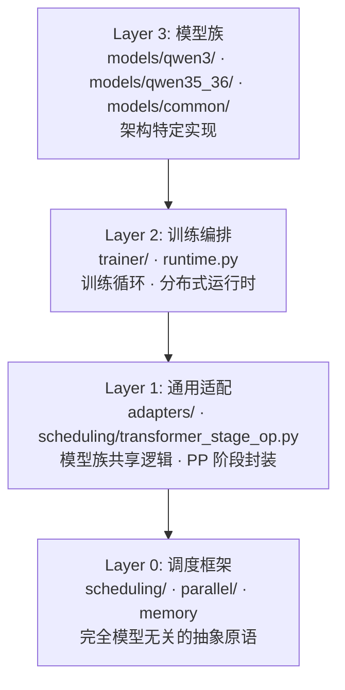

# Flow — 设施层

Flow（水流）是 GRASPO 的设施层，负责将 Ripple 的算法逻辑接入真实世界：分布式训练执行、模型加载、checkpoint 管理、训练循环编排。核心设计思想来自 Flink 等大数据分布式系统：**调度与计算分离**。

命名由来：Flow 承载数据在流水线各阶段间的持续流动——microbatch 在算子间穿梭，backpressure 调控节奏，如同水流在管道中推进。Ripple 捕获信用分配的涟漪效应，Flow 为涟漪提供流动的载体。

## 边界

- **入**：配置参数 + ripple 产出的算法结果（reward、advantage、group 决策）
- **出**：训练执行、模型权重更新、checkpoint 落盘、日志
- **职责**：GPU 通信、TP/PP 并行、模型加载、训练循环、checkpoint 存取
- **不碰**：算法逻辑（那是 ripple 的事）

## 四层架构

### Layer 0：调度框架（模型无关）

完全不知道模型、训练目标或层实现。只操作三个抽象概念：

**Microbatch** — 流经流水线的数据单元。携带 input token IDs、hidden states、training labels，以及位置标记。

**OpBuffer** — 算子间的 FIFO 缓冲。维护水位线，实现流水线背压（backpressure）：下游消费慢时自动阻塞上游生产。

**ComputeOperator** — 流水线中的一个计算阶段。绑定输入/输出 buffer，封装 forward 和 backward。算子不知道自己处理的是哪个模型层。

**PipelineScheduler** — 抽象调度策略。注册表内置 1F1B 调度（预热后交替执行 forward/backward，梯度累积）。PP=1 时自动退化为 TP-only 梯度累积 loop。

**PipelineGraph** — 流水线物理拓扑：依次连接的 operator 节点 + 转发 buffer。通过 `max_inflight_microbatches` 限制同时飞行的 batch 数，控制显存峰值。

### Layer 1：通用 Transformer 适配

**TransformerStageOp** — 继承 `ComputeOperator`，是流水线中的一个 transformer 阶段。持有模型中的若干 decoder layer，封装 layer forward、gradient checkpointing、TP all-reduce。

**TransformerAdapter** — 所有模型族的共享基类。提供 tokenizer 加载、chat template 应用、batch 整理、KV cache 管理、rollout 分块生成、rank 间 metric 聚合、随机数种子管理等通用能力。

### Layer 2：训练编排

**GraspoFlowRuntime** — TP/PP 运行时的入口。负责初始化并行状态、加载模型权重、构建流水线图、管理模型 sharding 和 placement plan。

**GraspoFlowTrainer** — RL 训练循环主类。通过 mixin 组合（RolloutMixin、OptimizeMixin、CheckpointMixin），训练主循环：ReplayBuffer 取 prompt batch → Rollout 生成 → Reward 打分 → Group 决策 → 计算 advantage → 优化 LoRA。

**SftTrainer** — SFT 训练循环。复用 Flow 的模型加载和 TP/PP 基础设施，但训练逻辑更简单：直接 cross-entropy loss，labels 中 mask 掉 prompt 部分。

### Layer 3：模型族

每个模型族在 `models/` 下有独立目录（如 `qwen3/`、`qwen35_36/`），包含 adapter（TransformerAdapter 子类）、model（causal LM wrapper）、ops（模型特定算子）。公共层在 `models/common/` 中按模型族拆分。

## 插件化适配

新增模型族只需：定义 `TransformerAdapter` 子类 → 实现模型特定的 forward/generation 钩子 → 注册到模型注册表。零侵入现有代码，不修改任何 flow 核心逻辑。

## TP LoRA 梯度同步

TP 模式下，所有 rank 处理相同数据并各自计算部分梯度。完整梯度是各 rank 部分梯度之和（SUM，非 DDP 的平均值）：

- `lora_a`（input projection）：权重非分片，TP rank 间共享 → 梯度需 SUM all-reduce
- `lora_b`（output projection）：按 output dimension 分片 → 每个 rank 只负责自己的分片维度，**不需要同步**

## KV Cache 策略

Rollout 生成阶段支持两种路径，通过 `model.supports_kv_cache` 属性在运行时选择：KV cache 路径（默认，逐 token decode 复用已计算的 KV 对）和 Full forward 路径（fallback，每次 decode 完整 forward）。

## Placement 策略

`NativePlacementPlan` 决定每层放到哪个 pipeline stage。默认策略：`qwen3_tp`（对 Qwen3 系列优化的均匀分布）、`auto`（基于层数的均匀划分）、手动（通过 `layer_ranges` 精确控制）。

## 统一 TP+PP

GraspoFlow 将 tensor parallel (TP)、pipeline parallel (PP) 和单 GPU 模式统一在一个框架下：`pp=1,tp=1`（单卡）、`pp=1,tp=N`（纯 TP）、`pp=N,tp=1`（纯 PP）、`pp=M,tp=N`（TP+PP 混合）。用户只需在配置文件中设 `tp_size` 和 `pp_size`，不需要理解后端差异。