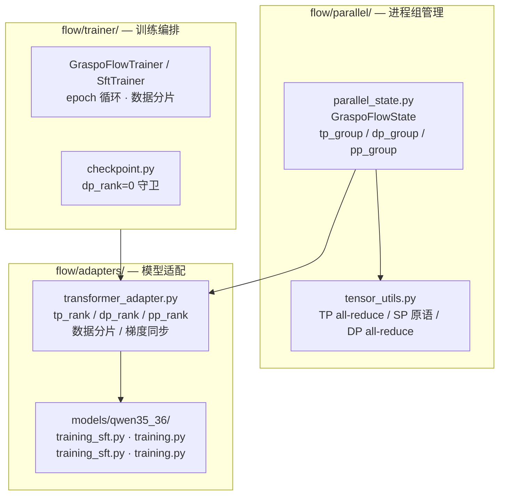
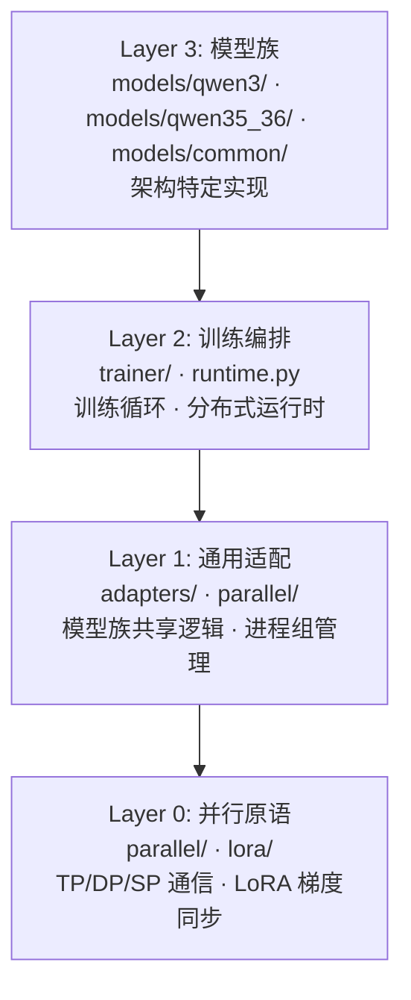

# Flow — 设施层

Flow（水流）是 GRASPO 的设施层，负责将 Ripple 的算法逻辑接入真实世界：分布式训练执行、模型加载、checkpoint 管理、训练循环编排。核心设计思想来自 Flink 等大数据分布式系统：**调度与计算分离**。

命名由来：Flow 承载数据在流水线各阶段间的持续流动——microbatch 在算子间穿梭，backpressure 调控节奏，如同水流在管道中推进。Ripple 捕获信用分配的涟漪效应，Flow 为涟漪提供流动的载体。

## 边界

- **入**：配置参数 + ripple 产出的算法结果（reward、advantage、group 决策）
- **出**：训练执行、模型权重更新、checkpoint 落盘、日志
- **职责**：GPU 通信、TP/DP/PP/SP 并行、模型加载、训练循环、checkpoint 存取
- **不碰**：算法逻辑（那是 ripple 的事）

## 五维并行架构



### 五维正交

| 维度 | 分片对象 | 通信操作 | 进程组 | 配置 |
|------|---------|---------|--------|------|
| **TP** | 模型参数（attention heads / MLP dims） | all_reduce(SUM) | `tp_group` | `tp_size` |
| **DP** | 训练数据 | all_reduce(AVG) | `dp_group` | `dp_size` |
| **PP** | 模型层 | send/recv | `pp_group` | `pp_size` |
| **SP** | 序列维度（激活值） | reduce_scatter + all_gather | `tp_group`（复用） | `sequence_parallel` |
| **Checkpoint** | 中间激活值（重计算） | 无 | — | `gradient_checkpointing` |

### 3D 进程组拓扑

```
rank = dp_rank × (tp_size × pp_size) + pp_rank × tp_size + tp_rank

dp_rank  = rank // (tp_size × pp_size)
tp_rank  = (rank // pp_size) % tp_size
pp_rank  = rank % pp_size
world_size = dp_size × tp_size × pp_size
```

**进程组示例**（dp=2, tp=2, pp=1, 4 GPUs）：

```
          tp=0    tp=1
dp=0      rank 0  rank 1    ← tp_group[0] = {0,1}
dp=1      rank 2  rank 3    ← tp_group[1] = {2,3}

dp_group[0] = {0,2}  dp_group[1] = {1,3}
```

### DP 梯度同步

DP 梯度同步在 TP 同步**之前**、optimizer.step() **之前**执行：

```
backward loop → DP all_reduce(AVG, dp_group) → TP all_reduce(SUM, tp_group)
→ clip_grad → optimizer.step()
```

**为什么 AVG 不是 SUM**：TP rank 处理相同数据、计算部分梯度 → SUM 恢复完整梯度。DP rank 处理不同数据、计算完整梯度 → AVG 得到平均梯度。

### DP 数据分片

DP 各 rank 处理不同数据分片：

```
总数据: [0, 1, 2, 3, 4, 5, 6, 7, ...]
         │         │         │         │
    dp_rank=0  dp_rank=1  dp_rank=2  dp_rank=3
```

SFT：`samples[dp_rank :: dp_size]`，每个 DP rank 独立训练自己的数据分片。
RL：rollout 阶段每个 DP rank 独立采样 prompt，replay_buffer 各自管理。

### SP 与 DP

SP 复用 TP 进程组，**不受 DP 影响**。每个 DP rank 内部有自己的 TP group，SP 在该 group 内独立运作。

```
DP rank 0: [GPU 0, GPU 1] ← TP group 0（SP 在此组内）
DP rank 1: [GPU 2, GPU 3] ← TP group 1（SP 在此组内）
```

### PP 与 DP

PP 1F1B 调度在每个 DP rank 内部独立运行。不同 DP rank 之间没有 PP 通信。

```
DP rank 0: [GPU 0 (stage 0), GPU 1 (stage 1)] ← PP group 0
DP rank 1: [GPU 2 (stage 0), GPU 3 (stage 1)] ← PP group 1
```

### Checkpoint 与 DP

- **保存**：只 `dp_rank=0` 保存（所有 DP rank 权重相同，梯度已同步）
- **加载**：`dp_rank=0` 加载文件 → broadcast 到同 DP group 的其他 rank
- **RNG 状态**：每个 DP rank 的 RNG 状态不同（不同数据分片），resume 时需要各自恢复

## 四层架构



### Layer 0：并行原语

- **parallel_state.py**：`GraspoFlowState` 管理 tp/dp/pp 三个进程组和 3D rank 拓扑
- **tensor_utils.py**：TP all-reduce、SP reduce_scatter/all_gather/scatter、DP all-reduce
- **lora_linear.py**：`_sync_nonsharded_lora_grads`（TP SUM）+ `_sync_dp_lora_grads`（DP AVG）

### Layer 1：通用适配

- **transformer_adapter.py**：所有模型族的共享基类。`_setup_distributed()` 初始化 3D 并行状态，`_shared_training_indices()` 在 DP group 内广播 shuffle 索引
- **placement.py**：`NativePlacementPlan` 决定每层放到哪个 PP stage，DP 不影响 placement

### Layer 2：训练编排

- **GraspoFlowRuntime**：运行时入口，初始化并行状态、加载模型权重
- **GraspoFlowTrainer**：RL 训练循环主类，通过 mixin 组合（RolloutMixin、OptimizeMixin、CheckpointMixin）
- **SftTrainer**：SFT 训练循环，DP 数据分片在 epoch 循环中完成

### Layer 3：模型族

每个模型族在 `models/` 下有独立目录（如 `qwen3/`、`qwen35_36/`），包含 adapter（TransformerAdapter 子类）、model（causal LM wrapper）、training（TP/DP/PP 训练循环）。公共层在 `models/common/` 中按模型族拆分。

## 插件化适配

新增模型族只需：定义 `TransformerAdapter` 子类 → 实现模型特定的 forward/generation 钩子 → 注册到模型注册表。零侵入现有代码，不修改任何 flow 核心逻辑。

## TP LoRA 梯度同步

TP 模式下，所有 rank 处理相同数据并各自计算部分梯度。完整梯度是各 rank 部分梯度之和（SUM，非 DDP 的平均值）：

- `lora_a`（input projection）：权重非分片，TP rank 间共享 → 梯度需 SUM all-reduce
- `lora_b`（output projection）：按 output dimension 分片 → 每个 rank 只负责自己的分片维度，**不需要同步**

## DP LoRA 梯度同步

DP 模式下，各 rank 处理不同数据并各自计算完整梯度。`dp_replicate_lora=true`（默认）时，每个 DP rank 有独立的 LoRA 副本，梯度需 AVG all-reduce 跨 DP group。

同步顺序：**DP(AVG) → TP(SUM) → clip_grad → optimizer.step()**。DP 先同步确保所有 DP rank 的梯度一致，TP 再修正非分片 LoRA 的部分梯度。

## KV Cache 策略

Rollout 生成阶段支持两种路径，通过 `model.supports_kv_cache` 属性在运行时选择：KV cache 路径（默认，逐 token decode 复用已计算的 KV 对）和 Full forward 路径（fallback，每次 decode 完整 forward）。

## Placement 策略

`NativePlacementPlan` 决定每层放到哪个 pipeline stage。默认策略：`qwen3_tp`（对 Qwen3 系列优化的均匀分布）、`auto`（基于层数的均匀划分）、手动（通过 `layer_ranges` 精确控制）。

## 统一 TP+DP+PP+SP

GraspoFlow 将五维并行统一在一个框架下：`dp=1,tp=1,pp=1`（单卡）到 `dp=D,tp=T,pp=P`（全并行）。用户只需在配置文件中设 `tp_size`、`dp_size`、`pp_size` 和 `sequence_parallel`，不需要理解后端差异。SP 在 TP>=2 时可选启用，自动复用 TP 进程组。Checkpoint 默认开启，用户无需配置。