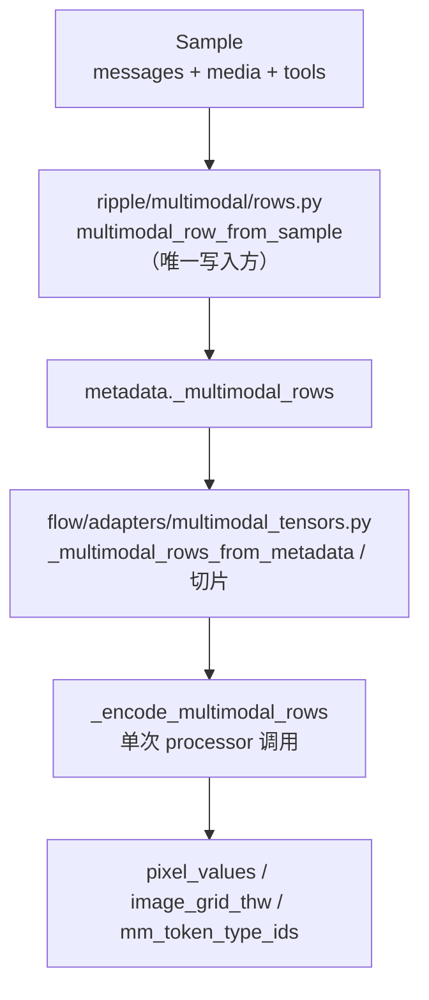
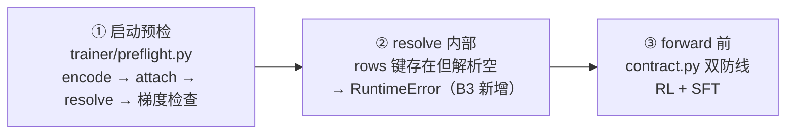

# 多模态训练架构

> GRASPO 多模态（图像）训练的数据流、分层与防线设计。
> 本文档描述**为什么这些防线存在**——v13 静默丢图空跑 19.5 小时、v14 崩溃都是催生这些设计的教训。

## 一、数据流总览

**单一真相源**：多模态**行构建**只在 `ripple/multimodal/rows.py`（`attach_rows` 是唯一写入方）。历史上有两份实现（core/data.py 私有版与 rows.py 公开版并存），重构后已统一——flow 侧只消费 rows 的公开函数。

## 二、两条训练路径

| 路径 | 行构建 | 编码 | 防呆 |
|------|--------|------|------|
| **RL**（GraspoFlowTrainer） | `multimodal_row_from_sample` → `attach_rows` 进 metadata | `_encode_multimodal_rows`（forward 前） | `assert_rl_training_has_multimodal`（forward 前）+ resolve 内部防线 |
| **SFT**（SFTTrainer） | `sft_tokenize_multimodal` → `MultimodalDeferred` | `_collate_sft_multimodal_batch`（collate 时） | `assert_sft_batch_has_multimodal`（collate 后、forward 前） |

两条路径都通过 `_encode_multimodal_rows` 一次性完成 tokenize + 视觉编码，保证
`input_ids` 与 `pixel_values` 来自同一次 processor 调用。

## 三、防线（按触发时机排序）

1. **启动预检**（`flow/trainer/preflight.py`）：数据含图时验证 encode → attach → resolve
   链路完整、visual LoRA 可训练（fake 1-step 梯度非零）。**PP>1 + 多模态在启动即拒绝**
   （PP 多模态生成未实现，不跑到 generate 才炸）。
2. **resolve 内部防线**（`flow/adapters/transformer.py`）：metadata 声明了 `_multimodal_rows`
   键但解析为空 → RuntimeError。防止"新调用点忘接线"导致的静默 None。
3. **forward 前契约**（`ripple/multimodal/contract.py`）：sequences 含图像 token 但
   metadata 无 rows → 硬失败（RL）；样本含 media 但 batch 无 multimodal_inputs → 硬失败（SFT）。

**为什么三层防线**：v13 的断链发生在"attach 未接线"——契约只接在调用点，新调用点
忘接线就静默丢图。三层防线保证：启动即暴露、解析即暴露、forward 前兜底。

## 四、张量工具（flow/adapters/multimodal_tensors.py）

- `_slice_multimodal_inputs`：等步长切片（rollout 同样本重复 G 次，每行图数相同）
- `_slice_multimodal_inputs_offset`：offset 表切片（异构样本，每行图数不同）
- `_compute_multimodal_offset_tables`：按 per-sample 图数 × rollout_group_size 展开的累计偏移

切片假设"同一 prompt 的 G 个 rollout 行共享相同图数"——`_compute_multimodal_offset_tables`
按此构造累计 offset。

## 五、已知限制

- **PP>1 + 多模态不支持**（qwen35_36 generation 的 PP 路径未实现）——启动预检直接拒绝，配置 `pp_size=1`
- **视频输入**：offset 表为视频预留了槽位（`video_offsets`），但当前训练路径不消费

## 六、历史教训

| 事故 | 根因 | 防线 |
|------|------|------|
| v13 空跑 19.5h（2026-07） | attach 未接线，图像 token 按纯文本嵌入，visual LoRA 零梯度 | 启动预检（梯度非零）+ 契约双防线 |
| v14 reward hacking 崩溃（2026-08） | 正则解析 XML 静默吞掉非法格式 | Qwen XML 严格解析（ripple/parsing/qwen_tool_parser.py，ElementTree + required 校验） |
