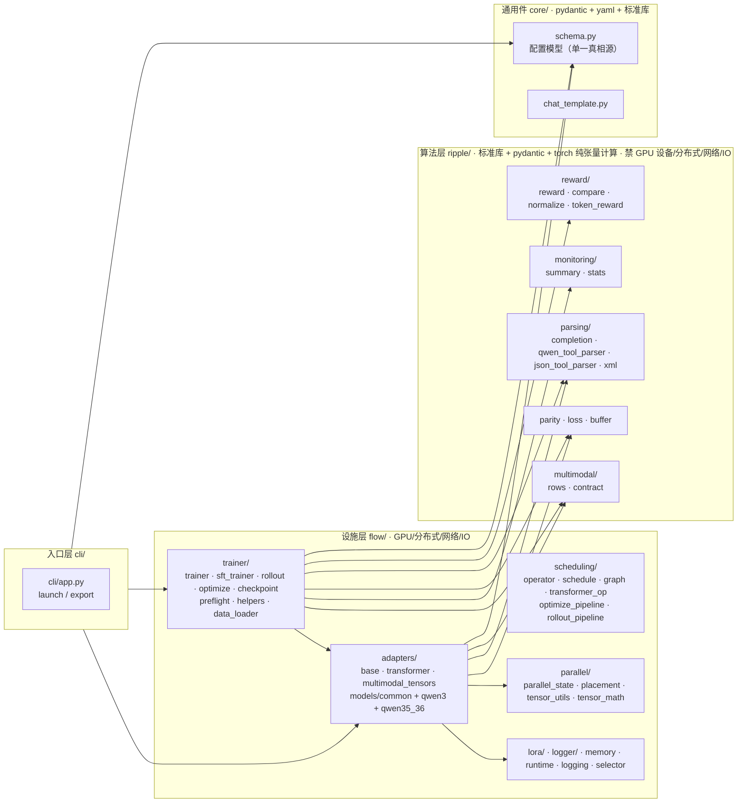

# GRASPO 架构重构计划 v2.1（1.0.0 发布前最后一次重构）

> 日期：2026-08-03（v2.0 → v2.1：按用户裁定修订——A/D 阶段不做、ripple 允许 torch、health 暂缓）
> **执行状态（2026-08-04 更新）**：阶段 B（B1-B6）✅ 完成、阶段 C（C1-C8）✅ 完成——
> 16 commit，379 测试 + ruff + mypy 全绿；已部署 121（graspo:v0.16.0），v16 训练验证中。
> 阶段 D（发布）按用户裁定独立于重构，等训练结果。
> 决策人：用户（graspo 架构所有者）
> 前置文档：`.local/multimodal-fix-plan-20260801.md`（旧计划）、`.local/multimodal-bug-investigation-20260801.md`（根因调查）、`.local/work_log_current.md`（状态区）
> 输入：3 份并行审查报告（代码盘点 / 原计划审查 / 宪法合规审计，2026-08-03）
> 原则：**正式版 1.0.0 前最后一次重构——架构定型（ripple/flow 分层）+ 宪法全量合规，一役毕功。reward 语义不动，发版独立于重构（等训练结果）。**

---

## 一、现状诊断（三份审查报告的关键事实）

### 1.1 代码现状

- 16,569 行源码 / 90 个 .py 文件 / 359 个测试（4,845 行）。包级依赖单向：`ripple → core → backends`，**无循环、无反向**（盘点实证）。
- **"修复完成、重构未做"中间态**：旧计划"先重构后修复"顺序被实际反转——断链修复与防呆（阶段 0/3）已做，目录重构（阶段 1）与边界净化（阶段 2）被跳过，只做了投机式最小改动。
- 算法层双命名空间并存：`core/` 持有全部算法主体（graspo_parity/reward/token_reward…），`ripple/` 只有 multimodal 两文件，且 `ripple/__init__.py` 反向 import core。
- **3 处系统性分层违例**：
  1. `core/data.py`（581 行）——纯逻辑（XML 构建、多模态行构建、校验）与设施（JSONL IO、tokenizer→tensor）同文件
  2. `core/logging.py`（71 行）——做文件 IO（mkdir/FileHandler），设施混入计算层
  3. 多模态行构建**双实现**：`core/data.py` 私有版 vs `ripple/multimodal/rows.py` 公开版，flow 侧仍消费 core 私名（§1.4 单一真相源违例）
- 模块级反向依赖：`models/* → runtime`（Layer 3 → Layer 2）；`generation.py` import core 下划线私有函数。
- `tensor_utils.py`（681 行）混合：TP all-reduce/cuda snapshot/文件 IO（设施）+ RoPE/causal mask/gated delta rule（纯张量数学）。
- 重复实现：`_timestamp/_set_random_seed/_backup_config` ×2（trainer/helpers vs sft_trainer）、`is_pure_tool_call_task` ×2、Qwen XML 格式字符串 2 处重建（data.py vs token_reward.py）。
- 测试镜像结构良好，但：models/qwen35_36 整个家族**零直接测试**、4 个 import-only 空壳测试、3 个测试文件测 scripts/ 而非 src。

### 1.2 旧计划完成度核对

| 阶段 | 状态 | 证据 |
|------|------|------|
| 0 防呆先行 | ✅ 完成（有缺陷） | 8490b1b；rows 复制进 ripple 但 data.py 原件未删 |
| 1 目录重构 | ❌ 完全未动 | core/ 仍持全部算法；无 flow/ 目录 |
| 2 边界净化 | ⚠️ 投机式执行 | 66634fc 建 models/common/qwen_tool_parser（去的是设施层而非计划要求的 ripple/）；transformer_adapter compute_loss 双分支仍在 |
| 3 断链修复 | ✅ 功能等价（两处偏差） | c674fd7；契约在调用点接线而非 resolve 内部；无 test_multimodal_flow.py |
| 4 验证实验 | ⚠️ 精神完成（版本路径偏离） | 走 v0.14.x 修复序列；logprob 差 <0.1 nats 未复测 |
| 遗留事项 | 公式 A / stale logprobs 已做 | dba8f96；dropout 一致性经查证为标准 train/eval 分离，非 bug，不做 |

### 1.3 宪法合规度：约 85%

**P0（1.0.0 前必须修）：**
- **P0-1 顶层配置键静默丢弃**（§7.2/§2.3）：`core/schema.py` 的 `from_dict` 用 `data.get()` 手动挑键，顶层拼错字段名（如 `train_methodd`）被静默忽略 → `extra="forbid"` 形同虚设，用户拿默认值训练而不自知
- **P0-2 trainer.py stub 死代码**（§18.1）：`backends/graspoflow/trainer.py` 被同名 `trainer/` 包遮蔽永不执行，自称"向后兼容"——宪法明文禁止的兼容残留
- **P0-3 硬编码版本号**（§8.7）：run.sh 回退 `0.14.5`、Dockerfile.incremental/from-local 注释写死标签。121 工作流 tar+scp 不含 .git → `git describe` 失败 → fallback 生效，镜像版本推进后 run.sh 找不到镜像（d03ceff 就是"发版改文件"模式的实证）

**P1（重构应一并处理）：** 模板与 schema 脱节（rollout_queue_batch_size 全部示例缺失、numeric_tolerance 主模板缺失）｜--smoke 覆盖配置值（§10.1）｜22 个文件头无职责声明（§12.4）｜docs 全 ASCII 图 0 Mermaid（§17.2）｜15 处宪法条款引用（防漂移条款被自己违反）｜ruff py311 vs mypy/`.python-version` 3.12 不一致

---

## 二、目标架构

### 2.1 三层结构



**边界规则（铁律）：**

| 层 | 允许依赖 | 禁止 | 判断标准 |
|----|---------|------|---------|
| `ripple/` | 标准库、pydantic、**torch（纯张量计算，CPU 可跑）** | GPU 设备调用（`.cuda()`/`torch.cuda`）、分布式、网络、文件 IO | 单测在 CPU 上跑通（不启动 GPU、不连网络、不读文件，§1.3） |
| `core/` | 标准库、pydantic、yaml（仅配置读取） | 其他一切设施 | 配置加载是 §7.1 宪法授权的唯一边界例外 |
| `flow/` | 一切设施 + 单向依赖 ripple/core | 无 | 反向依赖被 `FORBIDDEN` 守卫拦截（推广现有 runtime 模式） |

**命名约定：** `ripple/` 是 GRASPO 训练方法论的算法实现（reward/parity/parsing/monitoring——什么值给多少分、怎么判格式、怎么判健康、token 级奖励的涟漪传播），`core/` 是不依赖训练方法论的通用契约（配置、模板），`flow/` 是执行载体（怎么跑起来、怎么上 GPU）。一句话判断：**"改这个文件会让训练结果变吗？"会 → ripple；不会但和配置有关 → core；其余 → flow。**

**Ripple 命名的哲学依据（用户裁定）：** 强化学习中一个 token 的即时奖励并非孤立，它会对前后 token 的梯度传播产生"涟漪效应"（PPO 的 GAE / 时序差分的信用分配波浪式回传）。GRASPO-Ripple token 级奖励算法是这一命名的出处，必须驻留 ripple/。

### 2.2 完整目录树

```
src/graspo/
├── __init__.py            # 公开 API re-export（§8.6）
├── __main__.py
├── config.py              # 配置 re-export shim（真相在 core/schema.py）
├── cli/
│   ├── app.py             # launch/export（配置驱动，§10）
│   └── train_worker.py    # 训练 worker 入口（--smoke 运行边界化，§C5）
├── core/                  # 通用件层
│   ├── schema.py          # 全部 pydantic 配置模型（单一真相源）+ YAML 加载
│   └── chat_template.py   # chat template 渲染（纯逻辑）
├── ripple/                # ★ 算法层（torch 纯张量计算允许，CPU 可单测）
│   ├── __init__.py        # 层边界声明（禁 GPU/分布式/网络/IO 的防呆断言）
│   ├── parity.py          # 公式 A：group_advantages / classify_group（原 graspo_parity + advantage shim）
│   ├── loss.py            # GRASPOLoss + sft_cross_entropy_loss（原 graspo_loss + sft_loss）
│   ├── buffer.py          # ReplayBuffer / Experience（承载 tensor）
│   ├── reward/
│   │   ├── reward.py      # GraspoReward 三层评分（纯 Python）
│   │   ├── compare.py     # dict_compare_score / CompareResult / all_right
│   │   ├── normalize.py   # target 归一化（原 reward_helpers）
│   │   └── token_reward.py# GRASPO-Ripple 算法本体：token 级奖励/advantage（原 core/token_reward，torch 张量计算）
│   ├── parsing/
│   │   ├── completion.py  # ParsedCompletion（reward 前置数据模型）
│   │   ├── json_tool_parser.py    # 跨模型 JSON 解析（原 flow tool_parser）
│   │   ├── qwen_tool_parser.py    # Qwen XML 严格解析（原 models/common/qwen_tool_parser）
│   │   └── xml.py         # _tool_calls_to_xml 构建（从 core/data 迁入，单一真相源）
│   ├── multimodal/
│   │   ├── rows.py        # attach_rows（唯一写入方，吸收 data.py 重复实现）
│   │   └── contract.py    # 防呆契约（RL/SFT 双防线）
│   └── monitoring/
│       ├── summary.py     # monitor_group / reward_window_summary / training_health（保持现状，升级暂缓）
│       └── stats.py       # 统计数据结构（原 trainer/stats）
└── flow/                  # ★ 设施层
    ├── __init__.py        # re-export + FORBIDDEN_RUNTIME_MODULES 守卫推广
    ├── selector.py        # 后端注册表（原 backends/selector）
    ├── runtime.py         # TP/PP 运行时边界（GRASPO_ADAPTER 动态加载）
    ├── memory.py          # 显存预算
    ├── logging.py         # setup_logging（从 core 迁入，设施归位）
    ├── scheduling/        # 原 graspopoflow 根级：operator / schedule / graph / transformer_op
    │   ├── optimize_pipeline.py   # 原 optimize.py（改名防与 trainer/optimize 同名）
    │   └── rollout_pipeline.py    # 原 rollout.py（改名防与 trainer/rollout 同名）
    ├── parallel/
    │   ├── parallel_state.py
    │   ├── placement.py   # 层放置规划（调度算法，随设施层）
    │   ├── tensor_utils.py# TP all-reduce / cuda snapshot / safetensors / collate
    │   └── tensor_math.py # 纯张量数学（RoPE / mask / gated delta rule / 采样，从 tensor_utils 拆出）
    ├── lora/
    │   ├── lora.py        # LoRALinear（含 TP 梯度同步）
    │   ├── lora_io.py     # checkpoint/adapter 读写
    │   └── lora_helpers.py
    ├── logger/
    │   ├── logger.py      # NativeRolloutLogger（JSONL 领域日志）
    │   └── logger_helpers.py
    ├── adapters/
    │   ├── base.py        # BaseGraspoFlowAdapter（原 base_adapter）
    │   ├── transformer.py # TransformerAdapter（阶段 B 去算法化）
    │   ├── multimodal_tensors.py  # 张量切片/offset 工具（原 multimodal.py 拆分）
    │   └── models/
    │       ├── common/    # config / layers / layers_qwen3 / model_builders（阶段 B 拆出）
    │       ├── qwen3/     # adapter / model / ops（删 layers shim）
    │       └── qwen35_36/ # adapter + generation/training/training_sft/logprobs/ops/model
    └── trainer/
        ├── trainer.py     # GraspoFlowTrainer（主循环）
        ├── sft_trainer.py # SFTTrainer（删除重复实现）
        ├── rollout.py     # RolloutMixin（组生成/评分/retry/replay 提交）
        ├── optimize.py    # OptimizeMixin
        ├── checkpoint.py  # CheckpointMixin
        ├── preflight.py   # 多模态启动预检（防线）
        ├── helpers.py     # 设施工具（timestamp/seed/config backup；算法部分迁 ripple）
        └── data_loader.py # load_jsonl / write_jsonl / sft_tokenize（从 core/data 拆出）

tests/ 镜像：tests/core/、tests/ripple/、tests/flow/、tests/cli/、tests/e2e/
```

### 2.3 决策记录（用户裁定版）

| # | 决策点 | 结论 | 理由 |
|---|--------|------|------|
| D1 | ripple 依赖面 | **允许 torch 纯张量计算**（CPU 可单测）；禁 GPU 设备/分布式/网络/IO | Ripple 命名哲学：token 级奖励涟漪传播（GAE/时序差分信用分配）——GRASPO-Ripple 算法本体（token_reward）必须驻留 ripple/；loss/buffer 本就依赖 torch，统一归位 |
| D2 | core/ 去留 | **保留**，只留 schema + chat_template | 配置模型是跨层契约，yaml 读取是 §7.1 授权的唯一边界例外；ripple 专注训练方法论算法，core 专注通用契约 |
| D3 | 算法主体归属 | 全量迁 ripple/（parity/loss/buffer/reward/parsing/monitoring/multimodal） | 修复旧计划"算法层一分为二"缺陷；ripple 成为**唯一**算法层 |
| D4 | models/common/ 拆分 | qwen_tool_parser → ripple/parsing/；layers/config/model_builders → flow/adapters/models/common/ | 修复混层：解析器是 reward 前置算法，模型实现是设施；common 职责统一为"Qwen 家族共享模型件" |
| D5 | 同名文件冲突 | optimize.py → scheduling/optimize_pipeline.py；rollout.py → scheduling/rollout_pipeline.py | 旧计划照抄目录树会产生同名冲突 |
| D6 | shim 处理 | 全部删除（trainer.py/advantage.py 等）；顶层 config.py 保留为 §8.6 公开 re-export | §18.1 不留兼容层；P0-2 |
| D7 | 配置路径迁移 | **直接改配置**：schema 默认值、GRASPO_ADAPTER、服务器 yaml 同步更新——不做旧路径映射兼容层 | §18.1 不留兼容层；一次性同步（用户已确认可动服务器） |
| D8 | 策略层健康检查 | **暂缓**：monitoring 目录随 B 搬迁（summary/stats 保持现状），health 升级等 v15/v16 训练结果再定 | 用户裁定：当前无未解决 bug，不修不防，让训练数据说话 |
| D9 | 契约防线 | resolve 内部过契约 + 调用点防线**双保险** | 修复旧计划缺陷 #7（新调用点忘接线仍静默返回 None） |
| D10 | reward 语义 | **不动**（numeric_tolerance=10.0 是设计意图；v14 崩溃根因是 parser 非 tolerance） | 用户裁定：阶段 A 不做 |
| D11 | 1.0.0 发布流程 | **独立于本次重构**：训练验证（v15/v16 长训）结果出来后再定发版 | 用户裁定：训练测试时间长、变数多，阶段 D 不做 |
| D12 | dropout train/eval | **不做**（经查证是标准 train/eval 分离，非 bug） | 用户裁定 |
| D13 | --smoke 合规化 | **参数化运行边界**：--smoke 归类为基础设施参数（§10.1 合理例外），worker 执行到首轮 optimize 后退出，不触碰 config 对象 | 修复 P1-2（CLI 覆盖配置值） |

---

## 三、分阶段实施计划

> 顺序：**先搬家（分层 B）→ 后固本（合规 C）**。reward 语义不动，发版独立。
> 每阶段交付时：全量测试绿 + ruff + mypy + git commit（一个阶段一个 commit）。
> 实施期间 121 上的 v15 训练用镜像运行，不受本地代码改动影响。

### 阶段 B：ripple/flow 分层重构（2-3 天）

| 任务 | 内容 | 交付 |
|------|------|------|
| B1 | 建目录骨架，`git mv` 纯搬移（保历史），全量 import 更新（~30 文件） | 新目录树可 import |
| B2 | 双实现清理：data.py 三件套删除（rows 统一）｜XML 构建迁 ripple/parsing/xml.py｜`_timestamp/_set_random_seed/_backup_config` 去重｜`is_pure_tool_call_task`/`likely_truncated_json` 去重 | 单一真相源达成 |
| B3 | transformer_adapter 去算法化：compute_loss 双分支移除（loss 由 trainer 选）、GRASPOLoss 实例化移 trainer/optimize、契约进 `_multimodal_inputs_from_metadata` 内部 | 设施层纯设施 |
| B4 | model_builders 从 qwen3/model.py 拆出进 common（修正 qwen35_36 反向依赖 qwen3）、layers shim 删除（`import *` 清理） | 无反向依赖 |
| B5 | 配置迁移：schema.py:119 默认 adapter 路径、GRASPO_ADAPTER 环境变量、121 服务器 yaml 同步（D7） | 配置全部指向新路径 |
| B6 | 测试镜像迁移 + 补齐：tests/ripple/、tests/flow/；新增 test_multimodal_flow.py（旧计划承诺的端到端）、qwen35_36 家族基础测试；4 个 import-only 空壳测试补行为或删；3 个测 scripts/ 的测试位置定案 | 镜像结构完整 |

**验证：** 全量测试绿（迁移后数量不减）+ ruff + mypy + `graspo launch --smoke` 真机冒烟 + 121 增量构建后镜像内 grep 新路径。

### 阶段 C：宪法合规固本（1.5-2 天）

| 任务 | 内容 | 交付 |
|------|------|------|
| C1 | **P0-1**：`from_dict` 直通 `model_validate(data)`（去掉手动挑键），output_dir/run_name 默认值推导改 `model_validator(mode="after")`；补顶层未知键拒绝测试 | 顶层拼错字段名即报错 |
| C2 | **P0-2** 删 trainer.py stub；**P0-3** run.sh 回退改 0.0.0、Dockerfile `ARG BASE_IMAGE` 参数化、from-local 过期注释清理 | 版本号单一来源 |
| C3 | **P1-3** 文件头职责声明补齐（22 个）；**P1-5** 条款引用改写描述性语言；**P1-6** ruff target py312 | §12.4 全合规 |
| C4 | **P1-1** 模板补字段（rollout_queue_batch_size / numeric_tolerance）+ 防呆测试：模板字段集 ⊇ schema 字段集 | 模板与 schema 不脱节 |
| C5 | **P1-2** --smoke 运行边界化（D13，不改写 config 对象，归类基础设施参数并文档化）；**P1-4** docs 架构图改 Mermaid | §10.1 全合规 |
| C6 | 日志统一：rank_metrics.jsonl append 无时间戳 → 时间戳文件 + 轮转（work log 记录的坑）；resume 时 checkpoint 配置与当前配置一致性校验；PP+多模态启动防呆（media + pp_size>1 → 拒绝启动给明确错误） | 日志/恢复/防呆三件套 |
| C7 | docs 补齐：multimodal.md、分层文档（本计划 §二 沉淀）、架构图 Mermaid | 文档与架构同步 |

**验证：** 宪法 P0/P1 全清；全量测试绿 + 模板字段防呆 e2e 测试 + resume 场景测试。

---

## 四、范围边界

**本次重构做：** 分层重构（B）、宪法合规固本（C）。

**已裁定不做（记录在案）：**
- **reward 语义不动**：numeric_tolerance=10.0 是设计意图，v14 崩溃根因是 parser 已修（D10）
- **策略层健康检查升级**：暂缓，等 v15/v16 训练结果（D8）
- **v1.0.0 发布流程**：独立于重构，等训练验证结果（D11）
- **dropout train/eval 一致性**：经查证为标准 train/eval 分离，非 bug（D12）
- **PP + 多模态完整实现**（本次只做启动防呆 C6）、vllm 推理集成、多数据集混合训练：1.0.0 之后

---

## 五、文件迁移映射表

| 现状 | 新位置 | 动作 |
|------|--------|------|
| `core/graspo_parity.py` + `core/advantage.py` | `ripple/parity.py` | 移 + 合并 |
| `core/reward.py` / `core/compare.py` / `core/reward_helpers.py` / `core/token_reward.py` | `ripple/reward/{reward,compare,normalize,token_reward}.py` | 移（helpers 改名 normalize；token_reward 为 Ripple 算法本体） |
| `core/completion.py` | `ripple/parsing/completion.py` | 移 |
| `core/graspo_loss.py` + `core/sft_loss.py` | `ripple/loss.py` | 移 + 合并 |
| `core/buffer.py` | `ripple/buffer.py` | 移 |
| `flow tool_parser.py` | `ripple/parsing/json_tool_parser.py` | 移 + 改名 |
| `models/common/qwen_tool_parser.py` | `ripple/parsing/qwen_tool_parser.py` | 移 |
| `core/data.py` | 拆：XML 构建 → `ripple/parsing/xml.py`；多模态行 → 删（rows 统一）；JSONL IO + tokenize → `flow/trainer/data_loader.py` | 拆 + 删 |
| `core/logging.py` | `flow/logging.py` | 移 |
| `trainer/summary.py` + `trainer/stats.py` | `ripple/monitoring/{summary,stats}.py` | 移（health 升级暂缓） |
| `graspoflow 根级`（operator/schedule/graph/transformer_op/memory） | `flow/scheduling/` | 移（optimize→optimize_pipeline、rollout→rollout_pipeline） |
| `parallel_state/placement/tensor_utils` | `flow/parallel/` | 移（tensor_utils 拆出 tensor_math） |
| `lora/lora_io/lora_helpers` | `flow/lora/` | 移 |
| `runtime.py` | `flow/runtime.py` | 移 |
| `logger.py`/`logger_helpers.py` | `flow/logger/` | 移 |
| `base_adapter.py` / `transformer_adapter.py` / `multimodal.py` | `flow/adapters/{base,transformer,multimodal_tensors}.py` | 移 + 拆 |
| `models/` 全部 | `flow/adapters/models/` | 移（model_builders 拆出） |
| `trainer/` 全部 | `flow/trainer/` | 移（helpers 拆算法部分） |
| `backends/selector.py` | `flow/selector.py` | 移 |
| 根级 shim（trainer.py 等）| 删除 | 删 |
| `ripple/multimodal/` | 保留原地 | 吸收 data.py 重复实现 |
| `core/schema.py` / `core/chat_template.py` | 原地 | 留（D2） |

---

## 六、风险与依赖

1. **搬移面大（~30 文件 import 更新）**：纯机械但有遗漏风险——B5 配置路径迁移是关键（schema 默认值 + 服务器 yaml），D7 已决策直接改
2. **--smoke 语义变化**：冒烟入口行为变更（首轮 optimize 后退出），需真机验证
3. **日志 schema 变更影响既有分析脚本**：scripts/analyze_training.py 需同步（C6）
4. **121 服务器 yaml 同步**：`adapter:` 路径字符串更新后，若 v15 训练中途重启容器会加载新代码——**注意：v15 训练运行中，重构期间不重启其容器**（镜像已含旧路径代码，不受影响）；新容器用重构后镜像
5. **实施节奏**：重构期间 121 训练不受影响（镜像运行）；代码同步按既有 tar+scp+增量构建流程，构建后必须验证 md5 + grep 镜像内新路径（work log 血的教训）

---

## 七、决策结论汇总（v2.0 待决问题 → 用户裁定）

| 问题 | 裁定 | 落点 |
|------|------|------|
| Q1 ripple 零 torch 铁律？ | **允许 torch 纯张量计算**（CPU 可单测）；禁 GPU 设备/分布式/网络/IO | D1 |
| Q2 core/ 保留范围？ | 保留 schema + chat_template | D2 |
| Q3 服务器配置迁移？ | 直接改，不留兼容层 | D7 |
| Q4 health 检测默认档位？ | **暂缓**（等训练数据） | D8 |
| Q5 dropout 一致性进范围？ | 不做（标准 train/eval 分离，非 bug） | D12 |
| Q6 阶段顺序？ | 先 B 后 C；A（reward）与 D（发版）不做 | D10/D11 |
| Q7 --smoke 语义重构方向？ | 参数化运行边界（基础设施参数归类） | D13 |
