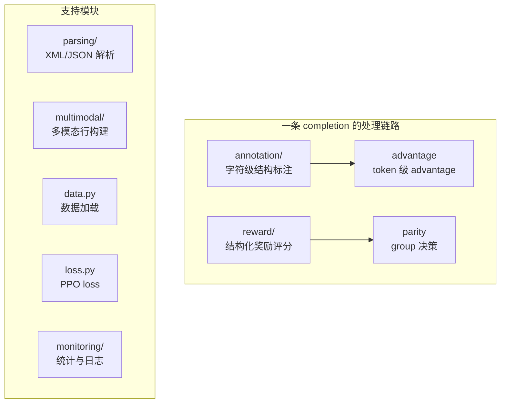

# Ripple — 算法层

Ripple（涟漪）是 GRASPO 的算法层，负责所有训练方法论相关的**纯计算**逻辑。零设施依赖——可以在单线程 CPU 上运行、可以单独测试、可以在任何环境复现。

命名由来：在强化学习中，一个 token 的即时奖励并非孤立——它通过 advantage 计算对前后 token 的梯度传播产生涟漪效应（ripple effect），信用分配如波浪般回传。Flow 承载数据流动，Ripple 捕获这一波浪式回传的微观动态。

## 边界

- **入**：配置参数 + 原始数据（completion 文本、targets、tokenizer）
- **出**：reward 分数、token 级 advantage、group 决策、loss 值
- **不碰**：GPU 设备、分布式通信、网络、文件 IO、Docker

## 五大模块

## 奖励体系

奖励是 ripple 的核心输出。每条 completion 得到一个结构化的奖励分数，由三个独立维度组成。奖励由 **`GraspoReward` 类**统一实现，并通过 `REWARD_REGISTRY` 注册/扩展——当前内置 `graspo` 一种，未来可注册新的 reward 类而无需改动调用端（算法层插件化）：

### 结构性标记奖励

检查 completion 是否包含预期的格式标记（JSON fence、thinking 标签、tool-call 结构）。格式正确但内容错误的 completion 也会得到基础分。

### 内容正确性奖励

从 completion 中提取 JSON/tool-call payload，与 targets 进行结构化比较：

- `dict_compare_score()`：递归比较 JSON 结构，叶子节点数值参与梯度信号，非数值叶子仅参与结构门控
- 支持多 target alternatives：每个 target 独立打分，取最佳匹配
- `all_right` 额外加分：内容完全匹配时额外加分

### 反冗余惩罚

对 filler text（非结构化内容）进行指数衰减惩罚，抑制冗长输出。

## 字符级标注（annotation/）

Rollout 完成后对每条 completion 做**字符级结构标注**，作为 token 级 advantage 的唯一输入。

### 设计哲学

- **字符级标注** `List[CharTag]`（S/V/T/W/E/D），长度恒等于 `len(completion)`，只标角色不打分
- **逐字符比对**：期望 mark 序列与模型输出逐字符比对，首个不匹配字符标 E。标注定义在字符级，token 由 offset_mapping 派生，天然 tokenizer 无关
- **严格对齐截断**：E 之后全部 D（不训练）；值错误不触发 E（下游相似度打分），仅结构/类型错误触发 E
- **与 reward 层语义一致**：只有语义错误标 E（缺字段/多余字段/拼错/类型错）

### CharTag 枚举

| 枚举 | 含义 | Advantage |
|------|------|-----------|
| S | 结构字符，与期望模板匹配 | +1.0 |
| V | 值字符（参数值 / JSON value） | 字段相似度 − μ_f |
| T | think 内容 | 0（不训练） |
| W | 前导/尾随/夹缝文本 | 0（不训练） |
| E | 首个与期望不匹配字符 | −1.0 |
| D | E 之后所有字符 | 0（不训练） |

### 模块结构

- `char_tag.py` — CharTag 枚举（StrEnum，含 trainable 属性）
- `tool_call_labeler.py` — Qwen XML tool call 标注：期望 mark 序列逐字符比对、参数无序集合匹配
- `json_labeler.py` — JSON 标注：围栏提取、状态机扫描、字段名拼错/多余检测
- `tokenize.py` — 字符标注 → token 标注（offset_mapping，E 优先合并）
- `labeler.py` — `annotate()` 主入口，format_type 由 `Sample.expects_tool_calls` 传入

### 测试数据集

`tests/data/annotation_testset_v3.jsonl`（65 条：tool call 44 + JSON 21）覆盖完美输出、值错误、前导文本、拼错、双调用、多余字段、缺字段、顺序颠倒、截断、乱码、嵌套结构等场景，作为标注模块回归基准。

## Token 级 Advantage

标注模块产出字符级 CharTag 后，advantage 层（`advantages.py`）将其转换为 token 级训练信号：

- **S → +1.0**：格式正反馈，不加权——格式收敛后 ratio→1 自动退场
- **V → 字段级相似度 − μ_f**：per-field 组内均值相对化，n=1 安全零
- **T / W / D → 0**：不训练
- **E → −1.0**：错误点惩罚
- **结构不完整**（截断/缺闭合/乱码）→ 末尾 EOS −1.0（max_new_tokens 硬截断除外）

**核心哲学**：不做 FORMAT/CONTENT 分类，每个 token 只关注"在当前前缀条件下与 GT 模板的对齐状态"。

## Group 决策体系

每个 rollout group（同一个 prompt 的 G 个 completion）根据 reward 分布进入不同处理路径：

| 决策 | 条件 | 行为 |
|------|------|------|
| **perfect_skip** | 全组 reward 均 ≥ 阈值 | 跳过训练，节省计算 |
| **trainable_max_correct** | 有方差 + best completion 正确 | 正常训练 |
| **trainable_not_correct** | 有方差 + best completion 不完全正确 | 正常训练 |
| **invalid** | best completion 有 parse error | retry（最多 5 次），仍失败则丢弃 |
| **invalid_no_preference_gap** | reward 完全相同（无组内方差） | 丢弃（无偏好信号） |
| **retry** | rollout 失败 | 重试（最多 5 次） |

**防线角色**：`reject_unparseable_groups = True` 是防线——格式损坏的 group 被拦截在训练边界之外。

## PPO Loss

`loss.py` 实现 GRPO 风格的 PPO loss。核心公式 A：`advantage_i = z_i × max(rewards)^p`（p=2），质量加权后全对组获得满推力，低分组获得弱推力，避免"组内最好但绝对很差"的 completion 被过度强化。

## 多模态契约（multimodal/）

多模态行构建的**单一真相源**在 `ripple/multimodal/rows.py`。三层防线防止静默丢图：

1. **启动预检**：数据含图时验证 encode → attach → resolve 链路完整，visual LoRA 梯度非零
2. **resolve 内部防线**：metadata 声明了 rows 键但解析为空 → RuntimeError
3. **forward 前契约**：sequences 含图像 token 但 metadata 无 rows → 硬失败

**为什么三层防线**：历史上有过"attach 未接线导致静默丢图"的事故——契约只接在调用点，新调用点忘接线就静默丢图。三层防线保证：启动即暴露、解析即暴露、forward 前兜底。

## 解析（parsing/）

Qwen XML tool call 解析器（`qwen_tool_parser.py`）是标签格式常量的**单一真相源**——标注模块和 reward 模块都引用它的常量，不各自定义。JSON 解析器（`json_tool_parser.py`）处理 JSON fence 内的内容提取。`xml.py` 提供 SFT target text 构建和 tool_calls → XML 序列化。